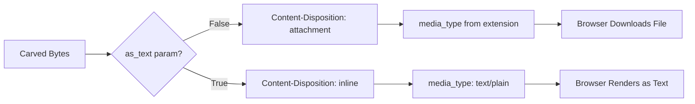

To add plain text viewing to your `/carve` endpoint, you need to make two changes:
Looking at your [`/carve`](app/modules/api/api.py:357) endpoint, the implementation is straightforward. The key difference between a browser download and inline text viewing is controlled by two factors:

## What Makes It a Download vs. Inline View



## Current Behavior (lines 398-410)

The file triggers a download because of:
1. **`Content-Disposition: attachment`** - tells the browser to download instead of display
2. **`media_type`** based on extension - could be `application/octet-stream` for unknown types

## What You Need to Change

Add a query parameter and modify the response:

```python
@app.get("/carve")
def carve(
    image: str,
    path: str = Query(..., description="File path in container"),
    as_text: bool = Query(default=False, description="View as plain text instead of download"),
):
```

Then modify the response logic:

```python
    if as_text:
        # Inline display as plain text
        return Response(
            content=content,
            media_type="text/plain; charset=utf-8",
            headers={
                "Content-Disposition": f'inline; filename="{filename}"',
                # ... other X-Carve-* headers
            }
        )
    else:
        # Current download behavior (unchanged)
        return Response(
            content=content,
            media_type=media_type,
            headers={
                "Content-Disposition": f'attachment; filename="{filename}"',
                # ...
            }
        )
```

## Key Differences

| Aspect | Download (current) | Plain Text View |
|--------|-------------------|-----------------|
| `Content-Disposition` | `attachment` | `inline` |
| `media_type` | Extension-based | `text/plain; charset=utf-8` |
| Browser behavior | Save dialog | Rendered in tab |

## Considerations

1. **Binary files**: Using `as_text=true` on a binary file (e.g., `.so`, `.bin`) will display garbage. You could optionally validate against known text extensions or try UTF-8 decoding with error handling.

2. **Large files**: Text rendering in-browser can be slow for very large files. You might want to add a size check.

3. **Charset**: Adding `charset=utf-8` helps the browser interpret the bytes correctly. If your carved files might have other encodings, you could make this configurable or detect it.

Would you like me to switch to code mode to implement this change?
**1. Add a query parameter:**
```python
as_text: bool = Query(default=False, description="View as plain text instead of download")
```

**2. Modify the response based on that parameter:**

The difference between download and inline viewing is controlled by:
- `Content-Disposition: attachment` (download) vs `Content-Disposition: inline` (view in browser)
- `media_type` from file extension vs `text/plain; charset=utf-8`

When `as_text=True`:
```python
return Response(
    content=content,
    media_type="text/plain; charset=utf-8",
    headers={
        "Content-Disposition": f'inline; filename="{filename}"',
        # keep your X-Carve-* headers
    }
)
```

When `as_text=False` (current behavior unchanged):
```python
return Response(
    content=content,
    media_type=media_type,  # extension-based
    headers={
        "Content-Disposition": f'attachment; filename="{filename}"',
        # ...
    }
)
```

**Usage:**
- `/carve?image=nginx/nginx:alpine&path=/etc/passwd` - downloads file
- `/carve?image=nginx/nginx:alpine&path=/etc/passwd&as_text=true` - renders in browser

**Considerations:**
- Binary files will display as garbage with `as_text=true`
- Large files may render slowly in browser
- The `charset=utf-8` in the media type helps proper character interpretation