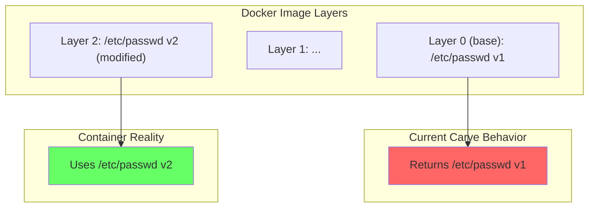

# BUG: Carve cannot carve from files in dot folders
 
## Problem Statement: 
Crane and dotdagdev confirm the contents of the public key at this path:
```bash
crane blob index.docker.io/drichnerdisney/ollama@sha256:8a0fc930b07955f6cf0662e9e2845115bb56870d60c87f4440cc76ad23d8c005 | tar -Oxz root/.ollama/id_ed25519.pub
ssh-ed25519 AAAAC3NzaC1lZDI1NTE5AAAAIPfGTOE28Myg4zJn8oCFe/yo9pphEmH7OAIUI1Qy148B
```

- I am attempting to carve the `image`: `drichnerdisney/ollama:v1` at the file path `root/.ollama/id_ed25519.pub`

- According to the `/fslog` route, the file is on layer idx[36] 

**Critical Insights**
- **This is related to the bug fixed in commit** `https://github.com/thesavant42/layerslayer/commit/3501423ba79472deee86fab216e131323c0b451c.diff`

```diff
diff --git a/plans/carve-as-text.md b/.ignore/completedplans/carve-as-text.md
similarity index 100%
rename from plans/carve-as-text.md
rename to .ignore/completedplans/carve-as-text.md
diff --git a/app/modules/api/api.py b/app/modules/api/api.py
index c20ea1c..42e279f 100644
--- a/app/modules/api/api.py
+++ b/app/modules/api/api.py
@@ -176,6 +176,8 @@ def fslog(image: str, path: str, layer: int = Query(default=None)):
         else:
             sys.argv = ["fs-log-sqlite.py", image, path]
         fs_log_sqlite.main()
+    except SystemExit:
+        pass  # fs-log-sqlite calls sys.exit() for empty results
     finally:
         sys.stdout = old_stdout
     
@@ -198,6 +200,8 @@ def fslog_search(q: str, image: str = Query(default=None), layer: int = Query(de
             if layer is not None:
                 sys.argv.append(str(layer))
         fs_log_sqlite.main()
+    except SystemExit:
+        pass  # fs-log-sqlite calls sys.exit() for empty results
     finally:
         sys.stdout = old_stdout
     
```
- this bug prevented the contents of folders with perious in their names from displaying their contents, which sounds very similar.
- T
### Proof: the ssh public key hash is: `ssh-ed25519 AAAAC3NzaC1lZDI1NTE5AAAAIPfGTOE28Myg4zJn8oCFe/yo9pphEmH7OAIUI1Qy148B`

## Task: Fix downloads from files with periods in their names

### Acceptance Criteria: 
- 1 Can download the public key contents and the results match the public key listed above
- 2 Can download the *private* key for that same file, whose contents I know but have not shared.


http://127.0.0.1:8000/carve?image=drichnerdisney%2Follama%3Av1&path=%2Fetc%2Fpasswd&as_text=true > works
```bash
root:x:0:0:root:/root:/bin/bash
daemon:x:1:1:daemon:/usr/sbin:/usr/sbin/nologin
bin:x:2:2:bin:/bin:/usr/sbin/nologin
sys:x:3:3:sys:/dev:/usr/sbin/nologin
sync:x:4:65534:sync:/bin:/bin/sync
games:x:5:60:games:/usr/games:/usr/sbin/nologin
man:x:6:12:man:/var/cache/man:/usr/sbin/nologin
lp:x:7:7:lp:/var/spool/lpd:/usr/sbin/nologin
mail:x:8:8:mail:/var/mail:/usr/sbin/nologin
news:x:9:9:news:/var/spool/news:/usr/sbin/nologin
uucp:x:10:10:uucp:/var/spool/uucp:/usr/sbin/nologin
proxy:x:13:13:proxy:/bin:/usr/sbin/nologin
www-data:x:33:33:www-data:/var/www:/usr/sbin/nologin
backup:x:34:34:backup:/var/backups:/usr/sbin/nologin
list:x:38:38:Mailing List Manager:/var/list:/usr/sbin/nologin
irc:x:39:39:ircd:/run/ircd:/usr/sbin/nologin
_apt:x:42:65534::/nonexistent:/usr/sbin/nologin
nobody:x:65534:65534:nobody:/nonexistent:/usr/sbin/nologin
ubuntu:x:1000:1000:Ubuntu:/home/ubuntu:/bin/bash
```

`http://127.0.0.1:8000/carve?image=drichnerdisney%2Follama%3Av1&path=%2Fetc%2Fshadow&as_text=true` works

```bash
root:*:20115:0:99999:7:::
daemon:*:20115:0:99999:7:::
bin:*:20115:0:99999:7:::
sys:*:20115:0:99999:7:::
sync:*:20115:0:99999:7:::
games:*:20115:0:99999:7:::
man:*:20115:0:99999:7:::
lp:*:20115:0:99999:7:::
mail:*:20115:0:99999:7:::
news:*:20115:0:99999:7:::
uucp:*:20115:0:99999:7:::
proxy:*:20115:0:99999:7:::
www-data:*:20115:0:99999:7:::
backup:*:20115:0:99999:7:::
list:*:20115:0:99999:7:::
irc:*:20115:0:99999:7:::
_apt:*:20115:0:99999:7:::
nobody:*:20115:0:99999:7:::
ubuntu:!:20115:0:99999:7:::
```

`http://127.0.0.1:8000/carve?image=drichnerdisney/ollama:v1&path=/root/.ollama/id_ed25519.pub/&as_text=true`

^ Hangs forever

Does NOT show up in the logs:
```bash
INFO:     Started server process [67876]
INFO:     Waiting for application startup.
INFO:     Application startup complete.
INFO:     127.0.0.1:29147 - "GET /docs HTTP/1.1" 200 OK
INFO:     127.0.0.1:29147 - "GET /openapi.json HTTP/1.1" 200 OK
INFO:     127.0.0.1:31661 - "GET /repositories?namespace=drichnerdisney HTTP/1.1" 200 OK
INFO:     127.0.0.1:32072 - "GET /carve?image=drichnerdisney%2Follama%3Av1&path=%2Fetc%2Fpasswd&as_text=true HTTP/1.1" 200 OK
INFO:     127.0.0.1:30472 - "GET /carve?image=drichnerdisney%2Follama%3Av1&path=%2Fetc%2Fpasswd&as_text=true HTTP/1.1" 200 OK
INFO:     127.0.0.1:61823 - "GET /carve?image=drichnerdisney%2Follama%3Av1&path=%2Fetc%2Fshadow&as_text=true HTTP/1.1" 200 OK
INFO:     127.0.0.1:23548 - "GET /carve?image=drichnerdisney/ollama:v1&path=/etc/shadow&as_text=true HTTP/1.1" 200 OK
```

```
http://127.0.0.1:8000/carve?image=drichnerdisney/ollama:v1&path=/etc/passwd&as_text=true
```
WORKS FINE

```bash
root:x:0:0:root:/root:/bin/bash
daemon:x:1:1:daemon:/usr/sbin:/usr/sbin/nologin
bin:x:2:2:bin:/bin:/usr/sbin/nologin
sys:x:3:3:sys:/dev:/usr/sbin/nologin
sync:x:4:65534:sync:/bin:/bin/sync
games:x:5:60:games:/usr/games:/usr/sbin/nologin
man:x:6:12:man:/var/cache/man:/usr/sbin/nologin
lp:x:7:7:lp:/var/spool/lpd:/usr/sbin/nologin
mail:x:8:8:mail:/var/mail:/usr/sbin/nologin
news:x:9:9:news:/var/spool/news:/usr/sbin/nologin
uucp:x:10:10:uucp:/var/spool/uucp:/usr/sbin/nologin
proxy:x:13:13:proxy:/bin:/usr/sbin/nologin
www-data:x:33:33:www-data:/var/www:/usr/sbin/nologin
backup:x:34:34:backup:/var/backups:/usr/sbin/nologin
list:x:38:38:Mailing List Manager:/var/list:/usr/sbin/nologin
irc:x:39:39:ircd:/run/ircd:/usr/sbin/nologin
_apt:x:42:65534::/nonexistent:/usr/sbin/nologin
nobody:x:65534:65534:nobody:/nonexistent:/usr/sbin/nologin
ubuntu:x:1000:1000:Ubuntu:/home/ubuntu:/bin/bash
```

---
---


## Analysis: Layer Index Parameter Missing from Carve Functions

### Current Behavior

Looking at [`carve_file()`](app/modules/keepers/carver.py:364) and [`carve_file_to_bytes()`](app/modules/keepers/carver.py:536), both functions:

1. Iterate through layers **in order** (base layer first, index 0):
   ```python
   for i, layer in enumerate(layers):  # Line 413 and 581
   ```

2. **Return on first match** - as soon as the target file is found, they stop searching

3. Have **no parameter** to specify which layer to search

### Impact for Files in Multiple Layers

This is a **significant correctness bug** for layered filesystems.



**Specific impacts:**

| Scenario | Expected | Actual (Current) |
|----------|----------|------------------|
| Config file modified in upper layer | Upper layer version | **Base layer version** |
| User added to `/etc/passwd` in layer 3 | File with new user | **Original file without user** |
| App config customized by Dockerfile | Customized config | **Default config** |
| Secrets added in final layer | Secrets visible | **Secrets missing** |

### Additional Issue: Whiteout Files

Docker uses `.wh.<filename>` markers to indicate deletions. If layer 2 deletes a file from layer 0, the carver will still extract the layer 0 version because whiteout detection isn't implemented.

---

## Effort to Correct

### Minimal Fix (Low effort - ~30 lines changed)

Add `layer_index` parameter and reverse default search order:

```python
def carve_file(
    image_ref: str,
    target_path: str,
    output_dir: str = DEFAULT_OUTPUT_DIR,
    chunk_size: int = DEFAULT_CHUNK_SIZE,
    verbose: bool = True,
    layer_index: Optional[int] = None,  # NEW: specific layer to search
) -> CarveResult:
```

**Changes needed:**

1. **Function signatures** - Add `layer_index: Optional[int] = None` to both [`carve_file()`](app/modules/keepers/carver.py:364) and [`carve_file_to_bytes()`](app/modules/keepers/carver.py:536)

2. **Layer iteration logic** (~10 lines each function):
   ```python
   if layer_index is not None:
       # Search specific layer only
       layers_to_search = [(layer_index, layers[layer_index])]
   else:
       # Search topmost first (correct overlay behavior)
       layers_to_search = list(reversed(list(enumerate(layers))))
   
   for i, layer in layers_to_search:
   ```

3. **Update CarveResult** - Add `layer_index: Optional[int] = None` field (already has `layer_digest`)

4. **Update callers** - [`api.py`](app/modules/api/api.py:379) call would need optional parameter exposed

### Time Estimate

| Task | Effort |
|------|--------|
| Add parameter to both functions | 15 min |
| Change iteration logic | 15 min |
| Update CarveResult dataclass | 5 min |
| Update API endpoint | 10 min |
| Add tests | 30 min |
| **Total** | **~1.5 hours** |

### Recommended Approach

**Option: Reverse search order by default + explicit layer_index**

This gives you:
- Correct behavior without breaking existing callers
- Ability to target specific layers when needed (e.g., forensics, comparing layer versions)
- Matches how Docker's overlay filesystem actually works