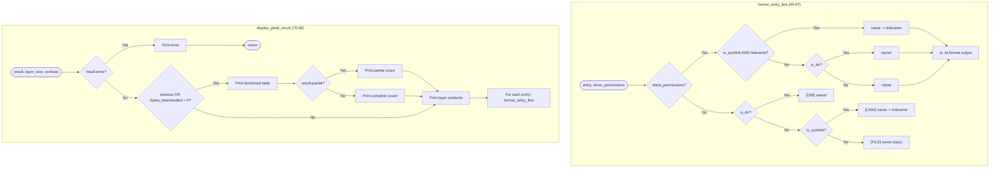

## Code Structure Overview for `layerslayer.py`

The file contains:
- 1 utility class ([`Tee`](layerslayer.py:28))
- 3 functions ([`format_entry_line()`](layerslayer.py:40), [`display_peek_result()`](layerslayer.py:70), [`parse_args()`](layerslayer.py:99))
- 1 main entry point ([`main()`](layerslayer.py:172))

## Main Control Flow Diagram

```mermaid
flowchart TD
    subgraph Entry["Entry Point"]
        START([__main__]) --> PARSE[parse_args]
        PARSE --> MAIN[main]
    end

    subgraph Setup["Setup Phase (172-220)"]
        MAIN --> LOG{args.log_file?}
        LOG -->|Yes| TEE[Setup Tee logging]
        LOG -->|No| IMG
        TEE --> IMG{args.image_ref?}
        IMG -->|Yes| USE_ARG[Use CLI image]
        IMG -->|No| PROMPT[Prompt user for image]
        USE_ARG --> CARVE_CHECK
        PROMPT --> CARVE_CHECK
    end

    subgraph CarveMode["Carve Mode (192-206)"]
        CARVE_CHECK{args.carve_file?}
        CARVE_CHECK -->|Yes| DO_CARVE[carve_file]
        DO_CARVE --> CARVE_OK{result.found?}
        CARVE_OK -->|Yes| EXIT0([exit 0])
        CARVE_OK -->|No| CARVE_ERR{result.error?}
        CARVE_ERR -->|Yes| PRINT_ERR[Print error]
        CARVE_ERR -->|No| EXIT1
        PRINT_ERR --> EXIT1([exit 1])
    end

    subgraph TokenManifest["Token & Manifest (208-246)"]
        CARVE_CHECK -->|No| LOAD_TOK[load_token]
        LOAD_TOK --> TOK_OK{token loaded?}
        TOK_OK -->|Yes| PRINT_TOK[Print token loaded]
        TOK_OK -->|No| PRINT_ANON[Print anonymous]
        PRINT_TOK --> GET_MAN[get_manifest]
        PRINT_ANON --> GET_MAN
        GET_MAN --> MAN_TUPLE{result is tuple?}
        MAN_TUPLE -->|Yes| UNPACK1[Unpack manifest, token]
        MAN_TUPLE -->|No| ASSIGN1[Assign manifest]
        UNPACK1 --> MULTI_ARCH
        ASSIGN1 --> MULTI_ARCH
    end

    subgraph MultiArch["Multi-Arch Handling (223-239)"]
        MULTI_ARCH{manifests key exists?}
        MULTI_ARCH -->|Yes| LIST_PLAT[List platforms]
        LIST_PLAT --> SELECT_PLAT[User selects platform]
        SELECT_PLAT --> GET_MAN2[get_manifest with digest]
        GET_MAN2 --> MAN_TUPLE2{result is tuple?}
        MAN_TUPLE2 -->|Yes| UNPACK2[Unpack manifest, token]
        MAN_TUPLE2 -->|No| ASSIGN2[Assign manifest]
        UNPACK2 --> BUILD_STEPS
        ASSIGN2 --> BUILD_STEPS
        MULTI_ARCH -->|No| SINGLE[Use manifest directly]
        SINGLE --> BUILD_STEPS[fetch_build_steps]
    end

    subgraph ModeSelection["Mode Selection (249-353)"]
        BUILD_STEPS --> BULK{args.bulk_peek?}
        BULK -->|Yes| BULK_MODE
        BULK -->|No| PEEK_ALL{args.peek_all?}
        PEEK_ALL -->|Yes| PEEK_MODE
        PEEK_ALL -->|No| SAVE_ALL{args.save_all?}
        SAVE_ALL -->|Yes| SAVE_MODE
        SAVE_ALL -->|No| INTERACTIVE
    end

    subgraph BulkPeek["Bulk Peek Mode (250-272)"]
        BULK_MODE[layerslayer_bulk] --> BULK_PRINT[Print combined filesystem]
        BULK_PRINT --> RETURN1([return])
    end

    subgraph PeekAll["Peek All Mode (275-303)"]
        PEEK_MODE --> PARTIAL1{args.partial?}
        PARTIAL1 -->|Yes| PRINT_PARTIAL1[Print partial message]
        PARTIAL1 -->|No| PRINT_COMPLETE1[Print complete message]
        PRINT_PARTIAL1 --> LOOP1
        PRINT_COMPLETE1 --> LOOP1
        LOOP1[For each layer] --> PARTIAL2{args.partial?}
        PARTIAL2 -->|Yes| PEEK_PARTIAL[peek_layer_blob_partial]
        PARTIAL2 -->|No| PEEK_COMPLETE[peek_layer_blob_complete]
        PEEK_PARTIAL --> DISPLAY1[display_peek_result]
        PEEK_COMPLETE --> DISPLAY1
        DISPLAY1 --> MORE1{more layers?}
        MORE1 -->|Yes| LOOP1
        MORE1 -->|No| RETURN2([return])
    end

    subgraph SaveAll["Save All Mode (306-311)"]
        SAVE_MODE[For each layer] --> DOWNLOAD1[download_layer_blob]
        DOWNLOAD1 --> MORE2{more layers?}
        MORE2 -->|Yes| SAVE_MODE
        MORE2 -->|No| RETURN3([return])
    end

    subgraph Interactive["Interactive Mode (314-352)"]
        INTERACTIVE[List layers] --> SEL_INPUT[User input selection]
        SEL_INPUT --> SEL_CHECK{empty or ALL?}
        SEL_CHECK -->|Yes| ALL_IDX[All indices]
        SEL_CHECK -->|No| PARSE_IDX[Parse comma-separated]
        ALL_IDX --> LOOP2
        PARSE_IDX --> LOOP2
        LOOP2[For each selected] --> PARTIAL3{args.partial?}
        PARTIAL3 -->|Yes| PEEK_PARTIAL2[peek_layer_blob_partial]
        PARTIAL3 -->|No| PEEK_COMPLETE2[peek_layer_blob_complete]
        PEEK_PARTIAL2 --> DISPLAY2[display_peek_result]
        PEEK_COMPLETE2 --> DISPLAY2
        DISPLAY2 --> DL_PROMPT{Download? y/N}
        DL_PROMPT -->|y| DOWNLOAD2[download_layer_blob]
        DL_PROMPT -->|N| MORE3
        DOWNLOAD2 --> MORE3{more layers?}
        MORE3 -->|Yes| LOOP2
        MORE3 -->|No| END([end])
    end
```

## Helper Function Branches

## Summary of Branch Points

| Location | Condition | Branches |
|----------|-----------|----------|
| Line 176 | `args.log_file` | Setup Tee logging or skip |
| Line 184 | `args.image_ref` | Use CLI arg or prompt user |
| Line 192 | `args.carve_file` | Enter carve mode (early exit) |
| Line 201-206 | `result.found` | Exit 0 or check error and exit 1 |
| Line 209 | `token` | Print loaded or anonymous |
| Line 217 | `isinstance(result, tuple)` | Unpack tuple or assign directly |
| Line 223 | `manifest_index.get("manifests")` | Multi-arch selection or single-arch |
| Line 250 | `args.bulk_peek` | Bulk peek mode |
| Line 275 | `args.peek_all` | Peek all mode |
| Line 286/333 | `args.partial` | Partial vs complete peek |
| Line 306 | `args.save_all` | Save all mode |
| Line 322 | `sel.upper() == "ALL"` | All layers or parse selection |
| Line 351 | User input `y` | Download layer or skip |

The code has 4 mutually exclusive operational modes (carve, bulk-peek, peek-all, save-all, interactive) with the interactive mode being the default fallback.