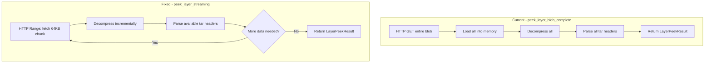

# Peek Streaming Refactor Implementation Plan

## Problem Statement

`peek_layer_blob_complete()` in [`peekers.py`](../../app/modules/finders/peekers.py:45) is misleadingly named and inefficient:

```python
# Line 71: Sets stream=True but then...
resp = auth.request_with_retry("GET", url, stream=True, timeout=120)

# Line 86: ...loads ENTIRE blob into memory anyway
compressed_data = resp.content
```

This downloads the entire compressed layer into memory before parsing, rather than streaming incrementally.

## Solution

Copy the incremental streaming pattern from [`carver.py`](../../app/modules/keepers/carver.py) - it is a reference implementation showing the correct approach:

| Pattern | carver.py Lines | To Copy Into |
|---------|-----------------|--------------|
| Incremental blob reader | 181-255 | peekers.py |
| Incremental gzip decompressor | 143-174 | peekers.py |
| Chunk-based processing loop | 423-512 | peekers.py |

**carver.py is a reference example - do not modify it or import from it**

## Architecture



## Implementation Steps

### Step 1: Add Incremental Classes to peekers.py

Copy these classes into peekers.py, adapted for peek use case:

```python
# =============================================================================
# Incremental Gzip Decompressor
# =============================================================================

class IncrementalGzipDecompressor:
    """
    Decompresses gzip data incrementally, maintaining state across chunk feeds.
    """
    
    def __init__(self):
        self.decompressor = zlib.decompressobj(16 + zlib.MAX_WBITS)
        self.buffer = b""
        self.bytes_decompressed = 0
        self.error: Optional[str] = None
    
    def feed(self, compressed_data: bytes) -> bytes:
        """Feed compressed data and return newly decompressed bytes."""
        if not compressed_data:
            return b""
        
        try:
            decompressed = self.decompressor.decompress(compressed_data)
            self.buffer += decompressed
            self.bytes_decompressed += len(decompressed)
            return decompressed
        except zlib.error as e:
            self.error = str(e)
            return b""
    
    def get_buffer(self) -> bytes:
        """Return the full decompressed buffer."""
        return self.buffer


# =============================================================================
# Incremental Blob Reader
# =============================================================================

class IncrementalBlobReader:
    """
    Fetches blob data in chunks using HTTP Range requests.
    """
    
    def __init__(
        self,
        auth: RegistryAuth,
        namespace: str,
        repo: str,
        digest: str,
        chunk_size: int = 65536,
    ):
        self.auth = auth
        self.url = f"{registry_base_url(namespace, repo)}/blobs/{digest}"
        self.chunk_size = chunk_size
        self.current_offset = 0
        self.bytes_downloaded = 0
        self.total_size = 0
        self.exhausted = False
    
    def fetch_chunk(self) -> bytes:
        """Fetch the next chunk of data. Returns empty bytes if exhausted."""
        if self.exhausted:
            return b""
        
        end_offset = self.current_offset + self.chunk_size - 1
        session = self.auth.get_session()
        headers = {"Range": f"bytes={self.current_offset}-{end_offset}"}
        
        try:
            resp = session.get(self.url, headers=headers, stream=True, timeout=30)
            
            if resp.status_code == 416:  # Range not satisfiable
                self.exhausted = True
                return b""
            
            if resp.status_code == 401:
                self.auth._token = None
                session = self.auth.get_session()
                resp = session.get(self.url, headers=headers, stream=True, timeout=30)
            
            resp.raise_for_status()
            
            content_range = resp.headers.get("Content-Range", "")
            if "/" in content_range:
                self.total_size = int(content_range.split("/")[-1])
            
            data = resp.raw.read(self.chunk_size)
            resp.close()
            
            if not data:
                self.exhausted = True
                return b""
            
            self.bytes_downloaded += len(data)
            self.current_offset += len(data)
            
            if self.total_size and self.current_offset >= self.total_size:
                self.exhausted = True
            
            return data
            
        except requests.RequestException as e:
            self.exhausted = True
            return b""
```

### Step 2: Create New Streaming Peek Function

Add `peek_layer_streaming()` to peekers.py:

```python
def peek_layer_streaming(
    auth: RegistryAuth,
    image_ref: str,
    digest: str,
    chunk_size: int = 65536,
) -> LayerPeekResult:
    """
    Stream and parse layer tar headers incrementally.
    
    Uses HTTP Range requests to fetch chunks, decompresses on-the-fly,
    and parses tar headers as data becomes available. Never holds
    entire compressed blob in memory.
    """
    user, repo, _ = parse_image_ref(image_ref)
    
    reader = IncrementalBlobReader(auth, user, repo, digest, chunk_size)
    decompressor = IncrementalGzipDecompressor()
    entries: List[TarEntry] = []
    parse_offset = 0
    
    while not reader.exhausted:
        compressed = reader.fetch_chunk()
        if not compressed:
            break
        
        # First chunk: verify gzip magic
        if reader.bytes_downloaded == len(compressed):
            if len(compressed) < 2 or compressed[0:2] != b'\x1f\x8b':
                return LayerPeekResult(
                    digest=digest, partial=False,
                    bytes_downloaded=reader.bytes_downloaded,
                    bytes_decompressed=0, entries_found=0, entries=[],
                    error="Not a gzip file",
                )
        
        decompressor.feed(compressed)
        
        if decompressor.error:
            return LayerPeekResult(
                digest=digest, partial=False,
                bytes_downloaded=reader.bytes_downloaded,
                bytes_decompressed=decompressor.bytes_decompressed,
                entries_found=len(entries), entries=entries,
                error=f"Decompression error: {decompressor.error}",
            )
        
        buffer = decompressor.get_buffer()
        
        # Parse all available tar headers
        while parse_offset + 512 <= len(buffer):
            entry, next_offset = parse_tar_header(buffer, parse_offset)
            if entry is None:
                break
            entries.append(entry)
            if next_offset <= parse_offset:
                break
            parse_offset = next_offset
    
    return LayerPeekResult(
        digest=digest, partial=False,
        bytes_downloaded=reader.bytes_downloaded,
        bytes_decompressed=decompressor.bytes_decompressed,
        entries_found=len(entries), entries=entries,
    )
```

### Step 3: Rename Old Function

Rename `peek_layer_blob_complete()` to `download_layer_to_memory()` to accurately describe what it does.

### Step 4: Update Call Sites

| File | Line | Change |
|------|------|--------|
| main.py | 9 | Update import |
| main.py | 232 | `peek_layer_blob_complete` -> `peek_layer_streaming` |
| main.py | 282 | `peek_layer_blob_complete` -> `peek_layer_streaming` |
| layerSlayerResults.py | 7 | Update import |
| layerSlayerResults.py | 106 | `peek_layer_blob_complete` -> `peek_layer_streaming` |
| layerslayer.py | 8 | Update import |
| finders/__init__.py | 1 | Update exports |

### Step 5: Update Exports

Update `app/modules/finders/__init__.py`:

```python
from .peekers import peek_layer_blob, peek_layer_streaming
from .peekers import download_layer_to_memory  # renamed from peek_layer_blob_complete
from .layerPeekResult import LayerPeekResult
from .config_manifest import get_image_config
```

### Step 6: Clean Up Dead Code

Evaluate for removal:
- `peek_layer_blob_partial()` - marked "TODO WE DONT WANT THIS"
- `peek_layer_blob_streaming()` - generator version

## File Changes Summary

| File | Change Type | Description |
|------|-------------|-------------|
| `app/modules/finders/peekers.py` | MODIFY | Add streaming classes, add peek_layer_streaming, rename old function |
| `app/modules/finders/__init__.py` | MODIFY | Update exports |
| `main.py` | MODIFY | Update imports and calls |
| `app/modules/keepers/layerSlayerResults.py` | MODIFY | Update import and calls |
| `app/modules/keepers/layerslayer.py` | MODIFY | Update import |

**carver.py is NOT modified - it is a reference only**

## Testing Plan

1. **Comparison test:** Verify `peek_layer_streaming()` returns identical entries as old function
2. **Memory test:** Verify peak memory is lower for large layers
3. **Integration test:** Run `--peek-all` and verify database population
4. **Carver test:** Verify carver still works unchanged

## Benefits

- Memory efficient: never holds entire compressed blob in memory
- Same complete file listing result
- Consistent with carver's proven approach
- Clearer naming of functions
