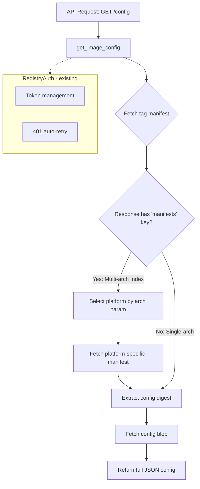

# Image Config Manifest - Implementation Plan

## Open Question Resolution

**Q:** The Shared auth module in auth.py sets `registry.docker.io`, *not* `registry-1.docker.io` - is that a problem?

**A:** No, this is NOT a problem. They serve different purposes:

| URL | Purpose | Location |
|-----|---------|----------|
| `registry.docker.io` | OAuth **service identifier** for token requests | `auth.py:49` - the `service` param |
| `registry-1.docker.io` | Actual **API endpoint** for v2 registry calls | `formatters.py:55` - `registry_base_url()` |

The token obtained with `service=registry.docker.io` is valid for API calls to `registry-1.docker.io`. The existing code already handles this correctly.

---

## Architecture Overview



---

## Implementation Tasks

### 1. Create `app/modules/finders/config_manifest.py`

New module containing the core logic:

```python
def get_image_config(
    namespace: str,
    repo: str,
    tag: str,
    registry: str = "registry-1.docker.io",
    arch: str = None  # None = first available, or specify: amd64, arm64, etc.
) -> dict:
    """
    Fetch the full image configuration JSON for a container image.
    
    Handles both multi-arch manifest lists and single-arch manifests.
    
    Returns:
        Full config blob as dict containing:
        - architecture, os, config.Env, config.Cmd, config.Entrypoint
        - config.WorkingDir, config.Labels, history, rootfs, etc.
    """
```

**Logic flow:**
1. Create `RegistryAuth(namespace, repo)`
2. Fetch manifest at `{registry}/v2/{namespace}/{repo}/manifests/{tag}`
3. If response contains `manifests` key (multi-arch index):
   - Filter by `arch` parameter or take first platform
   - Fetch the platform-specific manifest using its digest
4. Extract `config.digest` from the manifest
5. Fetch config blob at `{registry}/v2/{namespace}/{repo}/blobs/{config_digest}`
6. Return the full JSON config
7. Call `auth.invalidate()` for cleanup

### 2. Update `app/modules/formatters/formatters.py`

Modify `registry_base_url()` to accept optional registry:

```python
def registry_base_url(user, repo, registry="registry-1.docker.io"):
    return f"https://{registry}/v2/{user}/{repo}"
```

This maintains backward compatibility while enabling flexibility.

### 3. Update `app/modules/finders/__init__.py`

Export the new function:

```python
from .config_manifest import get_image_config
```

### 4. Add API Route in `app/modules/api/api.py`

New endpoint:

```python
@app.get("/repositories/{namespace}/{repo}/tags/{tag}/config")
async def get_tag_config(
    namespace: str,
    repo: str,
    tag: str,
    arch: str = Query(default=None, description="Target architecture: amd64, arm64, etc."),
    registry: str = Query(default="registry-1.docker.io", description="Registry host")
):
    """
    Fetch the full image configuration JSON for a tagged image.
    
    Returns environment variables, entrypoint, cmd, working directory,
    labels, build history, and other image metadata.
    """
```

---

## File Changes Summary

| File | Change Type | Description |
|------|-------------|-------------|
| `app/modules/finders/config_manifest.py` | **NEW** | Core logic for fetching image config |
| `app/modules/formatters/formatters.py` | **MODIFY** | Add optional `registry` parameter to `registry_base_url()` |
| `app/modules/finders/__init__.py` | **MODIFY** | Export `get_image_config` |
| `app/modules/api/api.py` | **MODIFY** | Add `/repositories/{namespace}/{repo}/tags/{tag}/config` route |

---

## API Usage Examples

```bash
# Basic usage - fetch nginx:latest config
GET /repositories/library/nginx/tags/latest/config

# Specify architecture for multi-arch images
GET /repositories/library/nginx/tags/latest/config?arch=arm64
```

---

## Response Structure

The API returns the raw config blob JSON as provided by the registry. See [`container-image-config/container-image-config.md`](container-image-config/container-image-config.md) for field documentation.

---

## Acceptance Criteria

- [ ] Function handles multi-arch manifest lists (selects by arch)
- [ ] Function handles single-arch manifests directly
- [ ] Returns full config JSON (not just build steps)
- [ ] Registry URL is configurable (defaults to registry-1.docker.io)
- [ ] API route exposed and documented
- [ ] Existing code remains backward compatible
