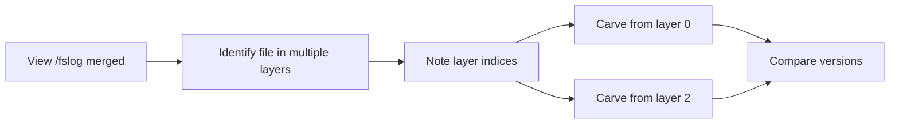

# Implementation Plan: Add layer_index Parameter to Carve Functions

## Problem Statement

When viewing `/fslog` without specifying a layer, the merged view shows files that exist in multiple layers with `[L0]`, `[L2]` markers and `(overridden)` status. However, there is currently **no way to carve a specific layer's version** of a file.

Example `/fslog` output:
```
drwxr-xr-x      0.0 B  2025-01-15 10:00  etc/                                [L2]
-rw-r--r--      1.2 KB 2025-01-15 10:00  etc/passwd                          [L2]
-rw-r--r--      1.0 KB 2025-01-10 08:00  etc/passwd                          [L0] (overridden)
```

To compare versions, users need to extract `/etc/passwd` from both L0 and L2 separately.

## Implementation Summary

Add an optional `layer_index` parameter to the carve functions that filters to a specific layer when provided, keeping current first-match behavior as the default.

---

## Files to Modify

### 1. carver.py - Core Functions

**File:** `app/modules/keepers/carver.py`

#### 1.1 Update CarveResult dataclass (line ~42)

Add `layer_index` field to track which layer the file was extracted from:

```python
@dataclass
class CarveResult:
    """Result of a file carving operation."""
    found: bool
    saved_path: Optional[str] = None
    target_file: str = ""
    bytes_downloaded: int = 0
    layer_size: int = 0
    efficiency_pct: float = 0.0
    elapsed_time: float = 0.0
    layer_digest: Optional[str] = None
    layer_index: Optional[int] = None  # NEW: which layer the file came from
    layers_searched: int = 0
    error: Optional[str] = None
```

Also update `to_dict()` method to include `layer_index`.

#### 1.2 Update carve_file() function (line ~364)

Add `layer_index` parameter and filter logic:

```python
def carve_file(
    image_ref: str,
    target_path: str,
    output_dir: str = DEFAULT_OUTPUT_DIR,
    chunk_size: int = DEFAULT_CHUNK_SIZE,
    verbose: bool = True,
    layer_index: Optional[int] = None,  # NEW: target specific layer
) -> CarveResult:
```

Update layer iteration (around line 413):

```python
# Determine which layers to search
if layer_index is not None:
    if layer_index < 0 or layer_index >= len(layers):
        return CarveResult(
            found=False,
            target_file=target_path,
            error=f"Layer index {layer_index} out of range (0-{len(layers)-1})",
        )
    layers_to_search = [(layer_index, layers[layer_index])]
else:
    layers_to_search = list(enumerate(layers))

# Step 3: Scan each layer
for i, layer in layers_to_search:
    # ... existing scanning logic ...
```

Update CarveResult return to include `layer_index=i`.

#### 1.3 Update carve_file_to_bytes() function (line ~536)

Same changes as `carve_file()`:
- Add `layer_index: Optional[int] = None` parameter
- Add layer filtering logic
- Include `layer_index` in returned CarveResult

---

### 2. api.py - REST Endpoint

**File:** `app/modules/api/api.py`

#### 2.1 Update /carve endpoint (line ~361)

Add `layer` query parameter:

```python
@app.get("/carve")
def carve(
    image: str,
    path: str = Query(..., description="File path in container, e.g., /etc/passwd"),
    layer: int = Query(default=None, description="Specific layer index to extract from"),
    as_text: bool = Query(default=False, description="Render as plain text in browser"),
):
```

Update function call:

```python
content, result = carve_file_to_bytes(image, path, layer_index=layer)
```

---

### 3. cli.py - Command Line Interface

**File:** `app/modules/cli.py`

#### 3.1 Add --carve-layer argument (after line ~48)

```python
p.add_argument(
    "--carve-layer",
    dest="carve_layer",
    type=int,
    default=None,
    help="Layer index to extract file from (use with --carve-file)",
)
```

---

### 4. main.py - CLI Handler

**File:** `main.py`

#### 4.1 Update carve_file call

Pass the layer parameter:

```python
result = carve_file(
    image_ref=args.image_ref,
    target_path=args.carve_file,
    output_dir=args.output_dir,
    verbose=not args.quiet,
    layer_index=args.carve_layer,
)
```

---

## Usage Examples

### API Usage

```bash
# Default: first layer containing the file
GET /carve?image=nginx/nginx:alpine&path=/etc/passwd

# Specific layer
GET /carve?image=nginx/nginx:alpine&path=/etc/passwd&layer=0
GET /carve?image=nginx/nginx:alpine&path=/etc/passwd&layer=2
```

### CLI Usage

```bash
# Default: first layer containing the file
python main.py -t nginx/nginx:alpine --carve-file /etc/passwd

# Specific layer
python main.py -t nginx/nginx:alpine --carve-file /etc/passwd --carve-layer 0
python main.py -t nginx/nginx:alpine --carve-file /etc/passwd --carve-layer 2
```

---

## Testing Scenarios

1. **No layer specified** - Should work exactly as before (first match)
2. **Valid layer index** - Should only search that specific layer
3. **Layer index out of range** - Should return error with valid range
4. **File not in specified layer** - Should return not found
5. **Multiple layers with same file** - Can extract each version separately

---

## Workflow for Comparing File Versions



Example workflow:
1. `GET /fslog?image=nginx/nginx:alpine&path=/etc` - See passwd in L0 and L2
2. `GET /carve?image=nginx/nginx:alpine&path=/etc/passwd&layer=0` - Get v1
3. `GET /carve?image=nginx/nginx:alpine&path=/etc/passwd&layer=2` - Get v2
4. Compare the two files

---

## Implementation Order

1. Update `CarveResult` dataclass
2. Update `carve_file()` function
3. Update `carve_file_to_bytes()` function  
4. Update `/carve` API endpoint
5. Update CLI arguments
6. Update main.py handler
