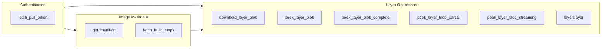
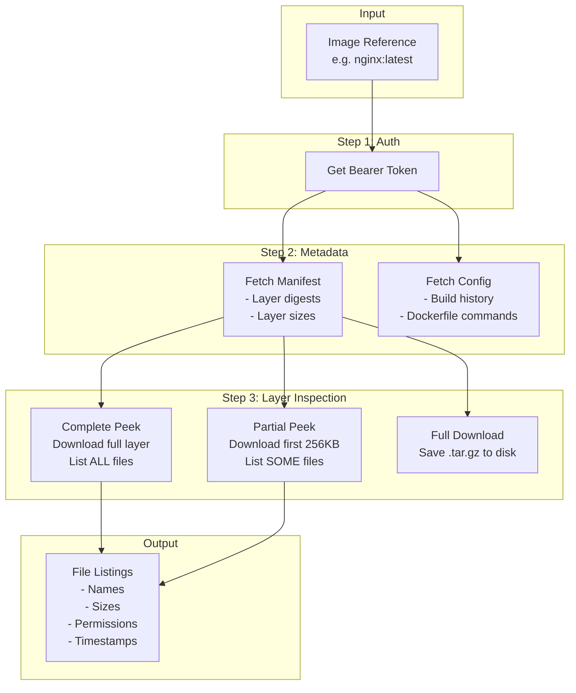

## fetcher.py - High-Level Function Overview

This module is the **network layer** for interacting with Docker registries. It handles authentication, fetching metadata, and retrieving layer contents.


## Corrected: fetcher.py - Peek Function Details

The key mechanism I was misunderstanding:

### How Tar Header Scanning Works

The tar format stores files as: `[512-byte header][content padded to 512-byte boundary][next header]...`

The [`parse_tar_header()`](tar_parser.py:108) function calculates `next_offset` by:
```python
content_blocks = (size + 511) // 512  # Round up to 512-byte blocks
next_offset = offset + 512 + (content_blocks * 512)
```

**The scanner reads the 512-byte header (which contains filename, size, permissions) and then SKIPS over the file content to the next header.**

This means:
- From 256KB compressed data, you might get ~1-2MB decompressed (gzip ratio)
- That decompressed buffer contains header + content + header + content...
- By only reading headers (512 bytes each) and jumping over content, you can enumerate **many more files** than would fit if you had to read content

---

### Corrected Function Summary

| Function | Downloads | Enumerates |
|----------|-----------|------------|
| [`peek_layer_blob()`](fetcher.py:220) | Entire layer | ALL files (uses Python tarfile) |
| [`peek_layer_blob_complete()`](fetcher.py:260) | Entire layer | ALL files (returns structured result) |
| [`peek_layer_blob_partial()`](fetcher.py:394) | First N bytes (default 256KB compressed) | As many files as fit in decompressed window by scanning headers |
| [`peek_layer_blob_streaming()`](fetcher.py:522) | First N bytes | Same as partial, yields entries progressively |
| [`layerslayer()`](fetcher.py:655) | All layers (complete) | ALL files across ALL layers |

---

### The Efficiency of Partial Peek

```
256KB compressed  -->  ~1-2MB decompressed
                           |
                           v
    [hdr1][content1][hdr2][content2][hdr3][content3]...
      ^                ^                ^
      |                |                |
    READ             JUMP             READ
    (512B)           OVER             (512B)
```

The partial peek can discover **many files** from a small download because:
1. It decompresses a window of data
2. It only reads 512-byte headers
3. It skips over file content (using the size field to calculate the jump)
4. It continues until it runs out of buffer space

---

### Data Classes

| Class | Purpose |
|-------|---------|
| [`LayerPeekResult`](fetcher.py:32) | Holds results from inspecting a single layer: file entries found, bytes downloaded, and any errors |
| [`LayerSlayerResult`](fetcher.py:56) | Aggregates results from inspecting ALL layers of an image into a combined filesystem view |

---

### Function Summary



---

### Authentication

| Function | What It Does |
|----------|--------------|
| [`fetch_pull_token()`](fetcher.py:86) | Gets a bearer token from Docker Hub's auth endpoint. Required before accessing private or rate-limited images. Saves token to file and injects into session headers for reuse. |

---

### Image Metadata Functions

| Function | What It Does |
|----------|--------------|
| [`get_manifest()`](fetcher.py:119) | Retrieves the image manifest JSON from the registry. This tells you what layers exist, their digests, and sizes. For multi-arch images, can fetch a specific platform's manifest by digest. |
| [`fetch_build_steps()`](fetcher.py:151) | Downloads the image config blob and extracts the Dockerfile history - the sequence of commands used to build the image (RUN, COPY, ENV, etc.). Useful for understanding what each layer contains. |

---

### Layer Operations

| Function | What It Does | Use Case |
|----------|--------------|----------|
| [`download_layer_blob()`](fetcher.py:183) | Downloads an entire layer to disk as a `.tar.gz` file. Full download, no inspection. | When you need the actual layer file for offline analysis or extraction |
| [`peek_layer_blob()`](fetcher.py:220) | Downloads entire layer, decompresses, and prints file listing to console. Simple output. | Quick interactive inspection |
| [`peek_layer_blob_complete()`](fetcher.py:260) | Downloads entire layer, returns structured [`LayerPeekResult`](fetcher.py:32) with all file entries. | When you need complete file listing with metadata (permissions, sizes, timestamps) |
| [`peek_layer_blob_partial()`](fetcher.py:394) | Uses HTTP Range request to fetch only first N bytes (default 256KB), decompresses, parses tar headers. **Does not download full layer.** | Fast preview - see what's at the beginning of a layer without downloading gigabytes |
| [`peek_layer_blob_streaming()`](fetcher.py:522) | Generator version of partial peek - yields entries one at a time as they're parsed. | Progressive UI display, can stop early |
| [`layerslayer()`](fetcher.py:655) | Iterates through ALL layers in an image, calling [`peek_layer_blob_complete()`](fetcher.py:260) on each, and merges results into combined filesystem view. | Get complete picture of what files exist across all layers of an image |

---

### Conceptual Data Flow



---

### Key Design Decisions

1. **Resilient Auth**: Every network function handles 401 errors by automatically refreshing the token and retrying once

2. **Streaming vs Complete**: Two strategies for layer inspection:
   - **Complete** (slow but thorough): Download full layer, see every file
   - **Partial** (fast but incomplete): Use HTTP Range requests to fetch only beginning, see files near the start of the tar

3. **Structured Results**: Functions return dataclasses ([`LayerPeekResult`](fetcher.py:32), [`LayerSlayerResult`](fetcher.py:56)) with:
   - File entries as [`TarEntry`](tar_parser.py:15) objects
   - Byte counts for efficiency tracking
   - Error messages for debugging

4. **Session Reuse**: A module-level [`session`](fetcher.py:22) object maintains TCP connections and headers across calls for efficiency

More analysis in [docs/fetcher-py.md](fetcher-py.md)

