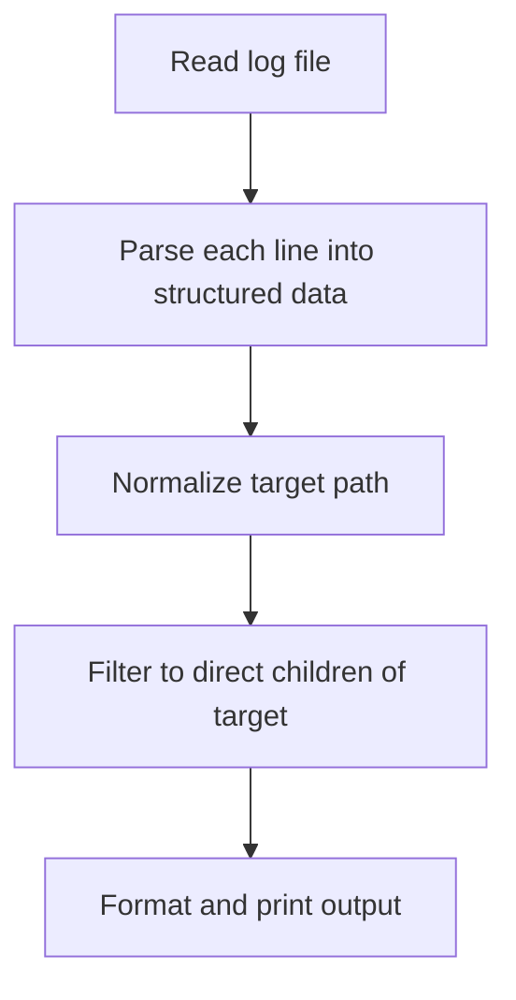

# fs_faker.py Implementation Plan
**COMPLETED**
## Overview

Build a Python script that filters Docker layer filesystem logs to display only the contents of a specific directory, simulating terminal navigation with `ls -la`.

## Acceptance Criteria Mapping

| Requirement | Source | Verification |
|-------------|--------|--------------|
| Takes log filename as first argument | [README.md:163-164](../layer-output-experiment/README.md) | `./fs_faker.py layer-0.txt "/"` works |
| Takes virtual path as second argument | [README.md:165](../layer-output-experiment/README.md) | Path `/` and `/etc` both work |
| Shows only direct children of target path | [README.md:50-51](../layer-output-experiment/README.md) | No nested subdirectory contents shown |
| Output mimics ls -la format | [README.md:59-95](../layer-output-experiment/README.md) | Permissions, size, date, name displayed |

## Log Format Analysis

From [layer-0.txt](../layer-output-experiment/layer-0.txt), the format is:

```
  drwxr-xr-x     0    0     0.0 B  2025-12-16 23:03  bin/
  lrwxrwxrwx     0    0     0.0 B  2025-12-16 23:03  bin/arch -> /bin/busybox
  -rw-r--r--     0    0     7.0 B  2025-12-16 23:02  etc/alpine-release
```

Fields (space-separated with variable whitespace):
1. Permissions: `drwxr-xr-x`, `lrwxrwxrwx`, `-rw-r--r--`
2. UID: `0`
3. GID: `0`
4. Size + Unit: `0.0 B`, `785.8 KB`, `4.7 MB`
5. Date: `2025-12-16`
6. Time: `23:03`
7. Path: `bin/`, `etc/alpine-release`
8. Link target (optional): `-> /bin/busybox`

Key observations:
- Paths are relative (no leading `/`)
- Directories end with `/`
- Symlinks contain ` -> target`

## Implementation Steps

### Step 1: Parse Log Lines

Create a function to parse each line and extract components:

```python
def parse_line(line: str) -> dict | None:
    # Returns dict with: permissions, uid, gid, size, date, time, path, link_target
```

Parsing strategy:
- Strip leading whitespace
- Use regex or split to handle variable whitespace
- Handle the size field which has two parts (number + unit)
- Detect symlinks by presence of ` -> `

### Step 2: Path Filtering Logic

Given a target directory, filter entries to show only direct children:

```python
def get_direct_children(entries: list, target_path: str) -> list:
    # For target "/" return: bin/, dev/, etc/, home/, lib/, ...
    # For target "/etc" return: alpine-release, apk/, busybox-paths.d/, ...
```

Logic:
1. Normalize target path (handle leading/trailing slashes)
2. For each entry, check if its parent directory matches target
3. Return only direct children (no nested paths)

Example for target `/`:
- `bin/` - YES (direct child of root)
- `bin/arch` - NO (child of bin, not root)
- `etc/` - YES (direct child of root)
- `etc/apk/` - NO (child of etc, not root)

Example for target `/etc`:
- `etc/alpine-release` - YES (direct child of /etc)
- `etc/apk/` - YES (direct child of /etc)
- `etc/apk/arch` - NO (child of /etc/apk)

### Step 3: CLI Interface

```python
#!/usr/bin/env python3
import sys

def main():
    if len(sys.argv) != 3:
        print("Usage: fs_faker.py <logfile> <path>")
        sys.exit(1)
    
    logfile = sys.argv[1]
    target_path = sys.argv[2]
    
    # Parse file, filter entries, display output
```

### Step 4: Output Formatting

Format output to mimic `ls -la`:

```
drwxr-xr-x     0    0     0.0 B  2025-12-16 23:03  bin/
lrwxrwxrwx     0    0     0.0 B  2025-12-16 23:03  bin/arch -> /bin/busybox
```

For initial version, preserve the original line format from the log file (it already looks like ls -la output).

## Data Flow



## Test Cases

### Test 1: Root Directory

```bash
./fs_faker.py layer-0.txt "/"
```

Expected: Shows `bin/`, `dev/`, `etc/`, `home/`, `lib/`, `media/`, `mnt/`, `opt/`, `proc/`, `root/`, `run/`, `sbin/`, `srv/`, `sys/`, `tmp/`, `usr/`, `var/`

### Test 2: Subdirectory /etc

```bash
./fs_faker.py layer-0.txt "/etc"
```

Expected: Shows `alpine-release`, `apk/`, `busybox-paths.d/`, `crontabs/`, `fstab`, `group`, etc.

### Test 3: Nested Directory /etc/apk

```bash
./fs_faker.py layer-0.txt "/etc/apk"
```

Expected: Shows `arch`, `keys/`, `protected_paths.d/`, `repositories`, `world`

## Simplifications for Experiment

Per requirements, keeping it simple:
- No interactive mode (single query per run)
- No `.` and `..` entries (future enhancement noted in README)
- No JSON export (future enhancement)
- Single layer file only
- No error handling for malformed lines (skip silently)

## Files to Create/Modify

| File | Action |
|------|--------|
| [layer-output-experiment/fs_faker.py](../layer-output-experiment/fs_faker.py) | Implement the script |

## Ready for Implementation

Switch to Code mode to implement the plan.
