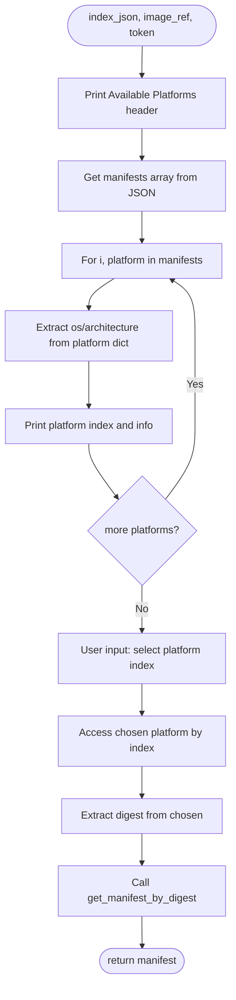
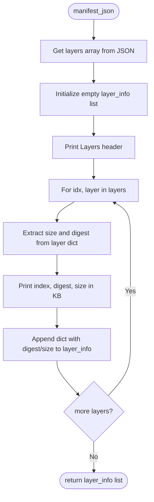
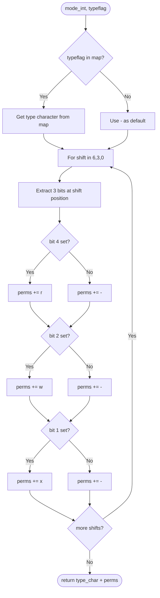
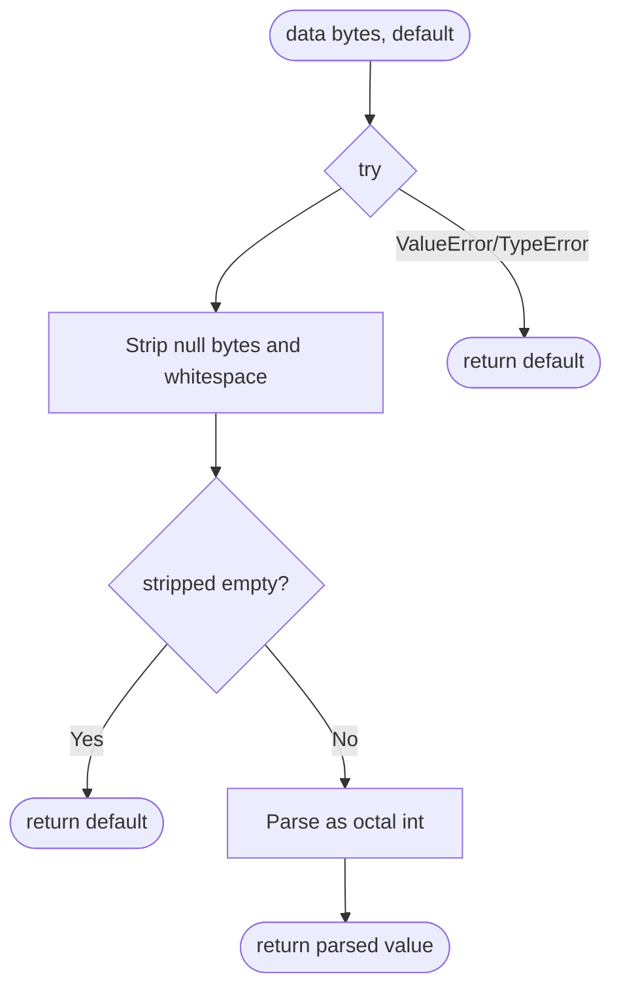
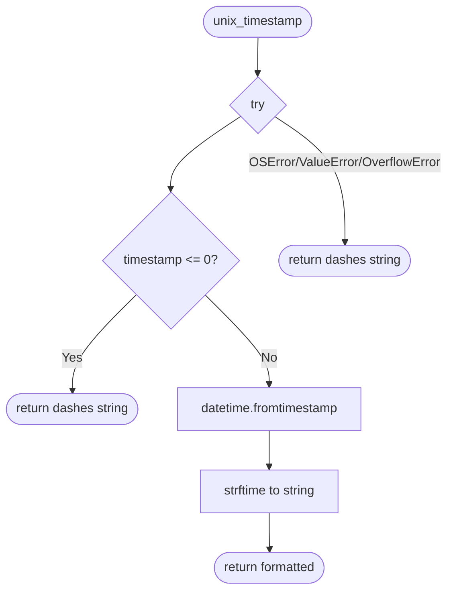
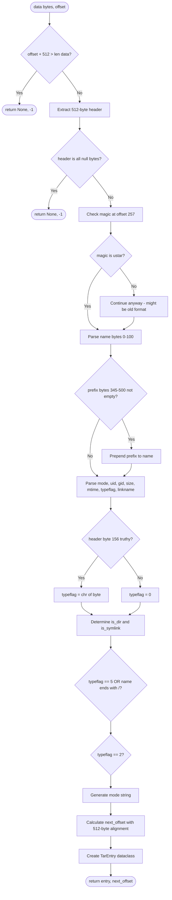
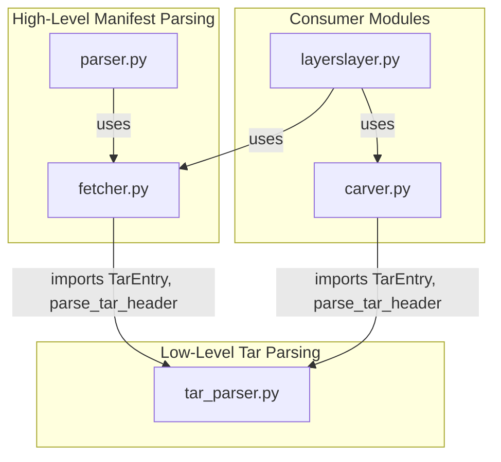

## Code Structure: parser.py vs tar_parser.py

These two files serve **completely different purposes** despite similar names. Here's the analysis:

---

## parser.py - Manifest/Config Parser (32 lines)

**Purpose:** Parses Docker/OCI **manifest JSON** data structures for platform selection and layer enumeration.

### Structure
- 2 functions
- Imports from [`fetcher`](fetcher.py) module
- Works with **JSON data**

### parse_index (6-17)

### parse_manifest (19-32)

### Branch Points

| Location | Condition | Branches |
|----------|-----------|----------|
| Line 10-12 | Loop iteration | Print each platform |
| Line 24-31 | Loop iteration | Process each layer |

---

## tar_parser.py - Binary Tar Header Parser (204 lines)

**Purpose:** Low-level **binary parsing** of 512-byte tar archive headers to extract file metadata without needing the complete tar file.

### Structure
- 1 dataclass ([`TarEntry`](tar_parser.py:15))
- 4 functions (3 private helpers + 1 public)
- Works with **raw bytes**
- Has explicit "DO NOT CHANGE" warning

### _mode_to_string (46-83)

### _parse_octal (86-94)

### _format_mtime (97-105)

### parse_tar_header (108-204) - Main Function

### Branch Points

| Location | Condition | Branches |
|----------|-----------|----------|
| Line 63-73 | `typeflag` in map | Return mapped char or default `-` |
| Line 78-81 | Permission bits | Add r/w/x or - for each position |
| Line 90-91 | Stripped data empty | Return default or parse |
| Line 93-94 | Parse exception | Return default |
| Line 100-101 | `timestamp <= 0` | Return dashes |
| Line 104-105 | Timestamp exception | Return dashes |
| Line 132-133 | Insufficient data | Return None, -1 |
| Line 138-139 | Null block (end of archive) | Return None, -1 |
| Line 143-145 | Magic check | Continue anyway if old format |
| Line 153-155 | Prefix exists | Prepend to filename |
| Line 174 | Typeflag byte truthy | Use char or default '0' |
| Line 181 | `typeflag == '5'` OR ends with `/` | Set is_dir |
| Line 182 | `typeflag == '2'` | Set is_symlink |

---

## Key Differences

| Aspect | parser.py | tar_parser.py |
|--------|-----------|---------------|
| **Purpose** | Parse Docker manifest JSON | Parse binary tar headers |
| **Input Type** | Python dict (from JSON) | Raw bytes |
| **Output** | Layer info dicts | TarEntry dataclass |
| **Level** | High-level API interaction | Low-level byte manipulation |
| **Dependencies** | Imports from fetcher.py | Self-contained |
| **User Interaction** | Has input() prompts | Pure parsing, no I/O |
| **Lines of Code** | 32 | 204 |
| **Complexity** | Simple dict access | Binary protocol parsing |

## Relationship in the Codebase

**Summary:**
- [`parser.py`](parser.py) handles **what's in the Docker image** at the manifest level (platforms, layers)
- [`tar_parser.py`](tar_parser.py) handles **what's inside each layer** at the binary tar archive level (files, directories, permissions)