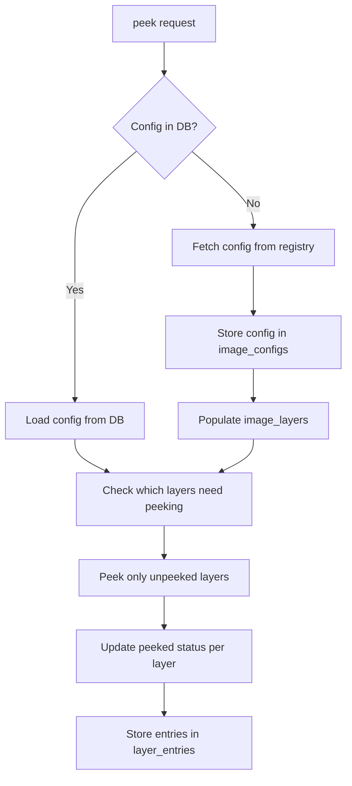

# Store Image Configs to SQLite - Detailed Plan

## Background

### Q1: Do we cache image configs to SQLite? Validate before read/write?

**Answer: NO - Image configs are NOT cached.**

The [`get_image_config()`](app/modules/finders/config_manifest.py:12) function fetches configs directly from the registry every time. The SQLite database only stores:
- `layer_metadata` - layer digest, index, size, entry counts
- `layer_entries` - filesystem entries from peeked layers

**Gap identified:** Image configs (ENV vars, CMD, history, labels) are fetched on every request.

---

## Problem Statement

We are not saving our image config lookups:
- This is an OSINT investigation tool
- Should avoid making unnecessary lookups to upstream services
- Does the config already exist? Look in the database first.
    - If cached, load from database
    - If not, download fresh config and store it

---

## Solution Overview

Store image configs as part of the `/peek` workflow. The image config contains the layer digest list in `rootfs.diff_ids`, making it the **source of truth** for:
1. Layer count per image
2. IDX to SHA256 digest mapping  
3. Peek status tracking per layer

---

## New SQLite Table: `image_configs`

```sql
CREATE TABLE IF NOT EXISTS image_configs (
    -- Primary key: config digest from manifest
    config_digest TEXT PRIMARY KEY,
    
    -- Image reference components
    owner TEXT NOT NULL,
    repo TEXT NOT NULL,
    tag TEXT NOT NULL,
    arch TEXT DEFAULT 'amd64',
    
    -- The full config JSON blob
    config_json TEXT NOT NULL,
    
    -- Extracted metadata for quick queries
    layer_count INTEGER NOT NULL,
    
    -- Timestamps
    fetched_at DATETIME DEFAULT CURRENT_TIMESTAMP,
    
    -- Unique constraint: one config per owner/repo/tag/arch combo
    UNIQUE(owner, repo, tag, arch)
);
```

### Design Notes

1. **config_digest as PK**: The config blob has its own digest in the manifest. This is stable and unique.
2. **config_json stores everything**: ENV, CMD, history, labels, and critically `rootfs.diff_ids` - the ordered list of layer digests.
3. **layer_count extracted**: For quick queries without parsing JSON.
4. **arch column**: Multi-arch images have different configs per architecture.

---

## New SQLite Table: `image_layers`

Track layer status separately for finer-grained peek tracking:

```sql
CREATE TABLE IF NOT EXISTS image_layers (
    -- Composite key
    config_digest TEXT NOT NULL,
    layer_index INTEGER NOT NULL,
    
    -- Layer identification
    layer_digest TEXT NOT NULL,
    layer_size INTEGER DEFAULT 0,
    
    -- Peek status
    peeked BOOLEAN DEFAULT 0,
    peeked_at DATETIME,
    entries_count INTEGER DEFAULT 0,
    
    -- Foreign key to image_configs
    FOREIGN KEY (config_digest) REFERENCES image_configs(config_digest),
    
    PRIMARY KEY (config_digest, layer_index)
);
```

### Design Notes

1. **Composite PK**: config_digest + layer_index uniquely identifies a layer
2. **peeked flag**: Quick check if layer has been enumerated
3. **Replaces need for layer_metadata**: This table becomes the authoritative source for layer tracking

---

## Workflow Changes

### Current Flow
```
/peek -> fetch manifest -> fetch config -> fetch layers -> store in layer_metadata
```

### New Flow



---

## API Extensions

### `/peek/status` - New Endpoint

Returns peek status for an image without triggering a peek:

```
GET /peek/status?image=nginx/nginx:alpine
```

Response:
```json
{
    "image": "nginx/nginx:alpine",
    "config_cached": true,
    "layer_count": 5,
    "layers": [
        {"idx": 0, "digest": "sha256:abc...", "size": 12345, "peeked": true},
        {"idx": 1, "digest": "sha256:def...", "size": 67890, "peeked": true},
        {"idx": 2, "digest": "sha256:ghi...", "size": 11111, "peeked": false},
        {"idx": 3, "digest": "sha256:jkl...", "size": 22222, "peeked": false},
        {"idx": 4, "digest": "sha256:mno...", "size": 33333, "peeked": false}
    ],
    "peeked_count": 2,
    "unpeeked_count": 3
}
```

### `/peek` - Existing Endpoint Enhancement

Add optional `status_only` parameter:
- `?status_only=true` - Same as `/peek/status`, no peek triggered
- Default behavior unchanged - peek all/specified layers

---

## Implementation Checklist

### Phase 1: Database Schema **COMPLETE**
- [x] Add `image_configs` table to [`storage.py`](app/modules/keepers/storage.py)
- [x] Add `image_layers` table to [`storage.py`](app/modules/keepers/storage.py)
- [x] Add migration for existing databases
- [x] Create helper functions:
    - `save_image_config()`
    - `get_cached_config()`
    - `get_layer_status()`
    - `update_layer_peeked()`

### Phase 2: Config Caching **COMPLETE**
- [x] Modify [`get_image_config()`](app/modules/finders/config_manifest.py:12) to check cache first
- [x] Store config after fetch
- [x] Extract and store layer digests in `image_layers` table

### Phase 3: API Integration **COMPLETE**
- [x] Add `/peek/status` endpoint to [`api.py`](app/modules/api/api.py)
- [x] Update `/peek` to use cached config when available
- [x] Update `/peek` to track which layers have been peeked
- [x] Add `status_only` parameter to `/peek`

### Phase 4: Carve Integration
- [ ] Update [`carve_file_to_bytes()`](app/modules/keepers/carver.py:553) to check `image_layers` table

---

## Benefits

1. **Reduced upstream requests**: Config fetched once, reused
2. **Layer count known upfront**: No out-of-range errors
3. **Peek progress visible**: UI can show which layers have been reviewed
4. **IDX mapping solved**: `/peek/status` provides the mapping
5. **OSINT audit trail**: Track what was investigated and when

---

## Relationship to Existing Tables

Current tables:
- `layer_metadata` - stores peek results (digest, size, entry counts)
- `layer_entries` - stores filesystem entries from peeked layers

New tables:
- `image_configs` - stores the image config JSON and metadata
- `image_layers` - tracks peek status per layer, references config

The new `image_layers` table provides the idx-to-digest mapping that `layer_metadata` lacks at the image level. Both can coexist:
- `image_layers`: "what layers does this image have, and have they been peeked?"
- `layer_metadata`: "details about a specific peeked layer"
- `layer_entries`: "filesystem entries within a layer"
