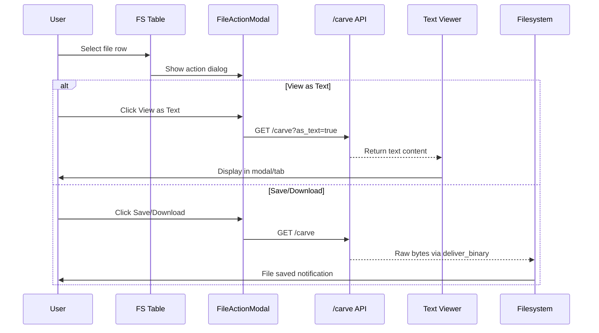

# Implementation Plan: File Viewing and Saving from FS Simulator

## Overview

This plan completes the final step of the first end-to-end user journey: viewing and saving files selected from the filesystem output in the FS Simulator tab.

## Current State

The FS Simulator already supports:
- Browsing filesystem entries via `/fslog` API
- Directory navigation (clicking directories navigates into them)
- Layer selection (single layer or merged view)
- Breadcrumb display showing current path

## Goal

When a user selects a **file** (not a directory) in the fs-table:
1. Present options to **View as Text** or **Save/Download**
2. Execute the chosen action using the `/carve` API

## API Reference

### /carve Endpoint

```
GET /carve?image={image}&path={path}&layer={layer}&as_text={boolean}
```

| Parameter | Required | Description |
|-----------|----------|-------------|
| `image` | Yes | `namespace/repo:tag` |
| `path` | Yes | Absolute path of file, e.g., `/etc/passwd` |
| `layer` | Yes | Layer index (integer) - use `/peek/status` to discover |
| `as_text` | No | `true` = render as plain text; `false` (default) = download binary |

## Implementation Tasks

### 1. Update File Selection Detection

**File**: [`app/tui/app.py`](app/tui/app.py)

**Current behavior**: [`_handle_fs_row_selection()`](app/tui/app.py:493) only handles directories and `..` navigation.

**New behavior**: Detect when a FILE is selected (not ending with `/`, not `..`):

```python
def _handle_fs_row_selection(self, row_data: tuple) -> None:
    # NAME column is index 3
    name = str(row_data[3])
    
    # Handle .. navigation (parent directory)
    if name == "..":
        # existing code...
        return
    
    # Handle directory navigation (ends with /)
    if name.endswith("/"):
        # existing code...
        return
    
    # Handle symlinks - extract target or follow
    if " -> " in name:
        # symlink handling - may want to resolve or show both options
        actual_name = name.split(" -> ")[0].strip()
        name = actual_name
    
    # FILE SELECTED - trigger carve workflow
    self._trigger_file_action(name)
```

### 2. Add File Action Modal

Create a modal dialog to let the user choose between viewing and saving:

```python
from textual.screen import ModalScreen
from textual.containers import Vertical
from textual.widgets import Button, Label

class FileActionModal(ModalScreen):
    """Modal to choose file action: View or Save."""
    
    BINDINGS = [("escape", "cancel", "Cancel")]
    
    def __init__(self, filename: str):
        super().__init__()
        self.filename = filename
    
    def compose(self) -> ComposeResult:
        with Vertical(id="file-action-dialog"):
            yield Label(f"Action for: {self.filename}", id="file-action-title")
            yield Button("View as Text", id="btn-view-text", variant="primary")
            yield Button("Save/Download", id="btn-save-file", variant="default")
            yield Button("Cancel", id="btn-cancel", variant="warning")
    
    def on_button_pressed(self, event: Button.Pressed) -> None:
        if event.button.id == "btn-view-text":
            self.dismiss(result="view")
        elif event.button.id == "btn-save-file":
            self.dismiss(result="save")
        else:
            self.dismiss(result=None)
    
    def action_cancel(self) -> None:
        self.dismiss(result=None)
```

### 3. Implement Carve Workflow

Add methods to DockerDorkerApp:

```python
def _trigger_file_action(self, filename: str) -> None:
    """Show modal and trigger carve based on user choice."""
    # Build full path
    if self.fs_path == "/":
        full_path = f"/{filename}"
    else:
        full_path = f"{self.fs_path}/{filename}"
    
    # Store for use in callback
    self._pending_carve_path = full_path
    self._pending_carve_filename = filename
    
    # Show modal
    self.push_screen(FileActionModal(filename), callback=self._on_file_action_chosen)

def _on_file_action_chosen(self, result: str | None) -> None:
    """Handle modal result."""
    if result == "view":
        self.carve_file_as_text(self._pending_carve_path)
    elif result == "save":
        self.carve_file_download(self._pending_carve_path, self._pending_carve_filename)
```

### 4. Implement Carve API Calls

#### View as Text

```python
@work(exclusive=True, group="carve")
async def carve_file_as_text(self, file_path: str) -> None:
    """Fetch file content and display as text."""
    fs_status = self.query_one("#fs-status", Static)
    
    try:
        # Determine layer - use fs_layer if set, otherwise need to handle merged view
        layer = self.fs_layer
        if layer is None:
            # For merged view, need to determine which layer has this file
            # Option 1: Extract from LAYER column of selected row
            # Option 2: Use the topmost layer (last in list)
            fs_status.update("Error: Cannot carve from merged view. Select a specific layer.")
            return
        
        async with httpx.AsyncClient(timeout=30.0) as client:
            fs_status.update(f"Fetching {file_path}...")
            
            response = await client.get(
                "http://127.0.0.1:8000/carve",
                params={
                    "image": self.fs_image,
                    "path": file_path,
                    "layer": layer,
                    "as_text": True
                }
            )
            response.raise_for_status()
            
            content = response.text
            
            # Display in a text viewer (see Task 5)
            self._show_text_viewer(file_path, content)
            fs_status.update(f"Viewing: {file_path}")
            
    except httpx.RequestError as e:
        fs_status.update(f"Request error: {e}")
    except httpx.HTTPStatusError as e:
        fs_status.update(f"HTTP error: {e.response.status_code}")
```

#### Save/Download

```python
@work(exclusive=True, group="carve")
async def carve_file_download(self, file_path: str, filename: str) -> None:
    """Download file and save using deliver_binary."""
    fs_status = self.query_one("#fs-status", Static)
    
    try:
        layer = self.fs_layer
        if layer is None:
            fs_status.update("Error: Cannot carve from merged view. Select a specific layer.")
            return
        
        async with httpx.AsyncClient(timeout=60.0) as client:
            fs_status.update(f"Downloading {file_path}...")
            
            response = await client.get(
                "http://127.0.0.1:8000/carve",
                params={
                    "image": self.fs_image,
                    "path": file_path,
                    "layer": layer,
                    "as_text": False
                }
            )
            response.raise_for_status()
            
            # Get raw bytes
            raw_bytes = response.content
            
            # Use deliver_binary to save
            import io
            binary_stream = io.BytesIO(raw_bytes)
            
            delivery_key = self.deliver_binary(
                binary_stream,
                save_filename=filename,
                save_directory="./downloads"  # Or let Textual use default
            )
            
            fs_status.update(f"Saved: {filename}")
            self.notify(f"File saved: {filename}", title="Download Complete")
            
    except httpx.RequestError as e:
        fs_status.update(f"Request error: {e}")
    except httpx.HTTPStatusError as e:
        fs_status.update(f"HTTP error: {e.response.status_code}")
```

### 5. Add Text Viewer Component

Option A: Use a new TabPane in LeftPanel:

```python
# In LeftPanel.compose():
with TabPane("File Viewer", id="file-viewer-tab"):
    yield Static("No file loaded", id="file-viewer-status")
    with VerticalScroll(id="file-viewer-scroll"):
        yield Static("", id="file-viewer-content")
```

Option B: Use a Modal with scrollable content:

```python
class TextViewerModal(ModalScreen):
    """Modal to display file content."""
    
    BINDINGS = [("escape", "close", "Close"), ("q", "close", "Close")]
    
    def __init__(self, title: str, content: str):
        super().__init__()
        self.title_text = title
        self.content_text = content
    
    def compose(self) -> ComposeResult:
        with Vertical(id="text-viewer-dialog"):
            yield Label(self.title_text, id="text-viewer-title")
            with VerticalScroll(id="text-viewer-scroll"):
                yield Static(self.content_text, id="text-viewer-content")
            yield Button("Close", id="btn-close")
    
    def on_button_pressed(self, event: Button.Pressed) -> None:
        self.dismiss()
    
    def action_close(self) -> None:
        self.dismiss()
```

### 6. Handle Layer Selection for Merged View

When in merged view (fs_layer is None), we need a strategy:

**Option 1**: Extract layer from the LAYER column of the selected row
- Row data contains layer info like "L15"
- Parse it: `int(row_data[4].replace("L", ""))`

**Option 2**: Require single-layer view for carving
- Show error message asking user to select a specific layer first

**Recommended**: Option 1 - use the layer from the row data

```python
def _handle_fs_row_selection(self, row_data: tuple) -> None:
    # ... existing code ...
    
    # FILE SELECTED
    name = str(row_data[3])
    layer_col = str(row_data[4])  # e.g., "L15" or ""
    
    # Determine effective layer
    if layer_col and layer_col.startswith("L"):
        effective_layer = int(layer_col[1:])
    elif self.fs_layer is not None:
        effective_layer = self.fs_layer
    else:
        # Error: cannot determine layer
        self.notify("Select a specific layer to carve files", severity="error")
        return
    
    self._trigger_file_action(name, effective_layer)
```

### 7. CSS Styling

Add styles for the modal dialogs in [`app/tui/styles.tcss`](app/tui/styles.tcss):

```css
/* File Action Modal */
#file-action-dialog {
    width: 50;
    height: auto;
    padding: 1 2;
    background: $surface;
    border: thick $primary;
}

#file-action-title {
    text-align: center;
    margin-bottom: 1;
}

#file-action-dialog Button {
    width: 100%;
    margin-top: 1;
}

/* Text Viewer Modal */
#text-viewer-dialog {
    width: 80%;
    height: 80%;
    padding: 1 2;
    background: $surface;
    border: thick $primary;
}

#text-viewer-scroll {
    height: 1fr;
    border: solid $primary-lighten-2;
}

#text-viewer-content {
    padding: 1;
}
```

## User Flow Diagram



## Edge Cases to Handle

1. **Empty files**: Handle 0-byte responses gracefully
2. **Large files**: Consider streaming for very large files
3. **Binary files with as_text**: May show garbled content - user's choice
4. **Network errors**: Show meaningful error messages
5. **Symlinks**: Decide whether to follow or show dialog asking
6. **Merged view without layer info**: Require user to select specific layer

## Testing Checklist

- [ ] Select a text file -> View works, content displays correctly
- [ ] Select a binary file -> Save works, file downloads
- [ ] Select directory -> Navigates (existing behavior preserved)
- [ ] Select `..` -> Goes up (existing behavior preserved)
- [ ] Cancel modal -> No action taken
- [ ] Network error during carve -> Error displayed, app recovers
- [ ] File in merged view with layer column -> Uses correct layer
- [ ] File in single-layer view -> Uses current layer

## Files to Modify

1. [`app/tui/app.py`](app/tui/app.py) - Main changes
2. [`app/tui/styles.tcss`](app/tui/styles.tcss) - Modal styling
3. [`plans/USERSTORY.md`](plans/USERSTORY.md) - Mark feature complete
