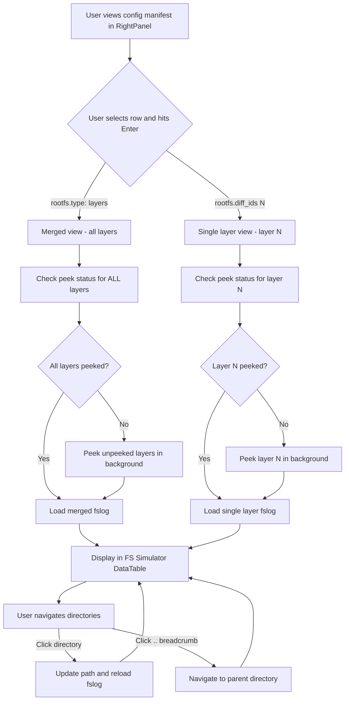

# FS Simulator Implementation Plan

## Overview

Add a filesystem simulation tab to the LeftPanel that displays layer contents from Docker images. Users can browse directories, navigate with breadcrumbs, and view either single-layer or merged-layer filesystem views.

## User Flow



## Implementation Tasks

### Task 1: Add FS Simulator Tab to LeftPanel

**File:** `app/tui/app.py`

Modify the [`LeftPanel`](app/tui/app.py:186) class to add a second tab:

```python
class LeftPanel(Static):
    def compose(self) -> ComposeResult:
        with TabbedContent():
            with TabPane("Search Results", id="search-results-tab"):
                # existing search results content
                ...
            with TabPane("FS Simulator", id="fs-simulator-tab"):
                yield Static("", id="fs-breadcrumb")  # Shows current path
                yield DataTable(id="fs-table", cursor_type="row")
```

**DataTable columns for fs-table:**
- `MODE` - permissions string like `drwxr-xr-x`
- `SIZE` - human readable size like `1.2 KB`
- `DATE` - modification date
- `NAME` - filename with `/` suffix for dirs, `-> target` for symlinks
- `LAYER` - layer index (only shown in merged view, optional)

### Task 2: Add App State for FS Navigation

**File:** `app/tui/app.py`

Add state variables to [`DockerDorkerApp`](app/tui/app.py:229):

```python
class DockerDorkerApp(App):
    # FS Simulator state
    fs_image: str = ""           # Current image: "namespace/repo:tag"
    fs_path: str = "/"           # Current directory path
    fs_layer: int | None = None  # None = merged view, int = single layer
    fs_is_merged: bool = False   # True when showing all layers
```

### Task 3: Handle Config Table Row Selection

**File:** `app/tui/app.py`

Modify or extend row selection handling to detect when user presses Enter on:
- `rootfs.type: layers` row → trigger merged layer view
- `rootfs.diff_ids[N]: sha256:...` row → trigger single layer view

Need to add a handler for the config-table DataTable that:
1. Parses the selected row to determine layer index or merged mode
2. Calls the peek status check
3. Triggers peeking if needed
4. Switches to FS Simulator tab and populates data

### Task 4: Create Peek Status Check Worker

**File:** `app/tui/app.py`

Add async worker method:

```python
@work(exclusive=True, group="peek")
async def check_and_peek_layer(self, image: str, layer: int | None) -> None:
    """
    Check peek status and peek if necessary.
    
    Args:
        image: Image reference like "namespace/repo:tag"
        layer: Layer index, or None for all layers
    """
    # 1. Call /peek?image=...&status_only=true
    # 2. Parse response to check if layer(s) are peeked
    # 3. If not peeked, call /peek?image=...&layer=N&status_only=false
    # 4. Call load_fslog() when done
```

### Task 5: Create FSLog Loader Worker

**File:** `app/tui/app.py`

Add async worker method:

```python
@work(exclusive=True, group="fslog")
async def load_fslog(self, image: str, path: str, layer: int | None) -> None:
    """
    Load filesystem entries and populate the fs-table.
    
    Args:
        image: Image reference
        path: Directory path to list
        layer: Layer index, or None for merged view
    """
    # 1. Build URL: /fslog?image=...&path=...&layer=N (or omit layer for merged)
    # 2. Parse response (currently plain text, may need JSON)
    # 3. Clear and populate fs-table DataTable
    # 4. Update fs-breadcrumb with current path
```

### Task 6: Add Directory Navigation

**File:** `app/tui/app.py`

Handle row selection in fs-table:

```python
def on_data_table_row_selected(self, event: DataTable.RowSelected) -> None:
    table = event.data_table
    
    if table.id == "fs-table":
        # Get selected row
        row_data = table.get_row_at(event.cursor_row)
        name = str(row_data[3])  # NAME column
        
        # Handle .. navigation
        if name == "..":
            self.fs_path = get_parent_path(self.fs_path)
            self.load_fslog(self.fs_image, self.fs_path, self.fs_layer)
            return
        
        # Handle directory navigation (ends with /)
        if name.endswith("/"):
            dir_name = name.rstrip("/")
            self.fs_path = join_path(self.fs_path, dir_name)
            self.load_fslog(self.fs_image, self.fs_path, self.fs_layer)
```

### Task 7: Add Breadcrumb Row

When populating fs-table, always add a `..` row at the top (unless at root `/`):

```python
# Add .. breadcrumb if not at root
if path != "/":
    fs_table.add_row("", "", "", "..")
```

### Task 8: Consider API Enhancement for JSON Response

**File:** `app/modules/api/api.py` (if needed)

The current `/fslog` endpoint returns plain text. Consider adding a parameter like `format=json` to return structured data that is easier to parse in the TUI:

```json
{
  "entries": [
    {
      "mode": "drwxr-xr-x",
      "size": "0.0 B",
      "date": "2024-04-22",
      "time": "06:08",
      "name": "bin",
      "is_dir": true,
      "link_target": "usr/bin",
      "layer": 0,
      "overridden": false
    }
  ],
  "path": "/",
  "image": "drichnerdisney/ollama:v1",
  "layer": null,
  "is_merged": true
}
```

### Task 9: Update Styles

**File:** `app/tui/styles.tcss`

Add any needed styles for the FS Simulator tab, breadcrumb display, and table formatting.

## API Endpoints Used

| Endpoint | Purpose |
|----------|---------|
| `GET /peek?image=...&status_only=true` | Check which layers are already peeked |
| `GET /peek?image=...&layer=N&status_only=false` | Peek a specific layer |
| `GET /fslog?image=...&path=/&layer=N` | Get single layer filesystem entries |
| `GET /fslog?image=...&path=/` | Get merged filesystem entries (all layers) |

## State Transitions

| Event | From State | To State | Action |
|-------|------------|----------|--------|
| Click `rootfs.type: layers` | Config view | FS merged | Check peek, load fslog(layer=None) |
| Click `rootfs.diff_ids[N]` | Config view | FS single | Check peek, load fslog(layer=N) |
| Click directory row | FS view | FS view (new path) | load fslog(path=new_path) |
| Click `..` row | FS view | FS view (parent) | load fslog(path=parent) |

## Suggested Implementation Order

1. Add the FS Simulator tab structure to LeftPanel (UI scaffolding)
2. Add app state variables for FS navigation
3. Add the fslog loader worker (test with hardcoded image/path first)
4. Add the peek status check worker
5. Wire up config-table row selection to trigger peek/load
6. Add directory navigation and breadcrumb handling
7. Polish: styles, loading indicators, error handling
