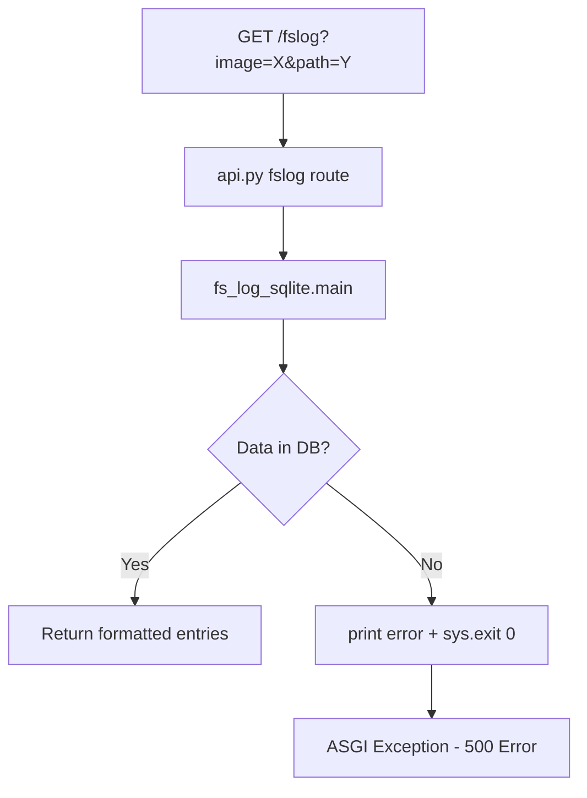
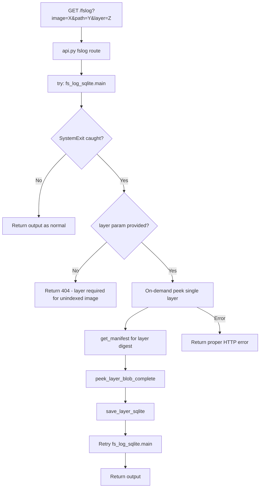
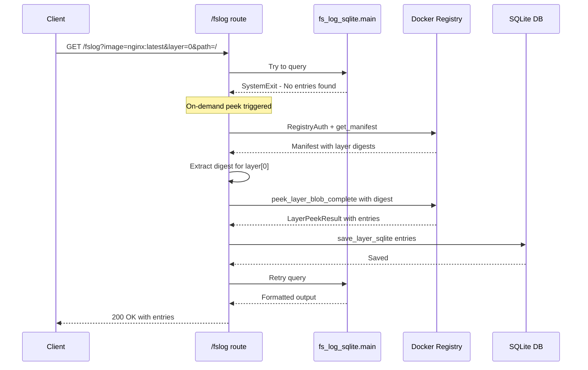

# fslog Error Handling and On-Demand Peek Implementation Plan

## Overview

This plan addresses two issues with the `/fslog` API endpoint:

1. **Unhandled exceptions** when querying non-indexed images (caused by `sys.exit()` calls)
2. **No on-demand indexing** - users must pre-index images before browsing

## Current Architecture



## Target Architecture



---

## Task 1: Handle SystemExit in api.py

### Problem Analysis

The [`fs-log-sqlite.py`](../../app/modules/fs-log-sqlite.py) script calls `sys.exit(0)` when no entries are found. When called from FastAPI via [`api.py`](../../app/modules/api/api.py:77), this raises a `SystemExit` exception that crashes the ASGI server.

### Solution: Wrap in try/except

In [`api.py`](../../app/modules/api/api.py:63), wrap the `fs_log_sqlite.main()` call:

```python
@app.get("/fslog", response_class=PlainTextResponse)
def fslog(image: str, path: str, layer: int = Query(default=None), arch: int = Query(default=0)):
    if not IMAGE_PATTERN.match(image):
        raise HTTPException(status_code=400, detail="Invalid image reference format")
    
    old_stdout = sys.stdout
    sys.stdout = captured_output = StringIO()
    
    try:
        if layer is not None:
            sys.argv = ["fs-log-sqlite.py", image, str(layer), path, "--single-layer"]
        else:
            sys.argv = ["fs-log-sqlite.py", image, path]
        
        try:
            fs_log_sqlite.main()
        except SystemExit as e:
            # fs-log-sqlite calls sys.exit(0) when no entries found
            output = captured_output.getvalue()
            if "No entries found" in output:
                # Trigger on-demand peek if layer specified
                if layer is not None:
                    # ... on-demand peek logic here ...
                    pass
                else:
                    raise HTTPException(status_code=404, detail=output.strip())
            # Re-raise other exit codes
            if e.code != 0:
                raise HTTPException(status_code=500, detail=f"fslog error: {output}")
    finally:
        sys.stdout = old_stdout
    
    return captured_output.getvalue()
```

---

## Task 2: Implement On-Demand Layer Peek

### Required Components

To peek a single layer on-demand, we need:

1. **Image reference** - e.g., `library/nginx:latest`
2. **Layer index** - e.g., `0`, `1`, `2`
3. **Layer digest** - must be fetched from manifest via [`get_manifest()`](../../app/modules/keepers/downloaders.py:44)

### Existing Functions to Reuse

- [`RegistryAuth`](../../app/modules/auth/auth.py:14) - handles Docker registry authentication
- [`get_manifest()`](../../app/modules/keepers/downloaders.py:44) - fetches image manifest with layer digests
- [`peek_layer_blob_complete()`](../../app/modules/finders/peekers.py:45) - downloads and parses a single layer
- [`save_layer_sqlite()`](../../app/modules/keepers/storage.py:214) - persists layer entries to database
- [`init_database()`](../../app/modules/keepers/storage.py:29) - initializes/connects to SQLite
- [`parse_image_ref()`](../../app/modules/formatters/formatters.py) - parses image reference

### Data Flow



### Solution: Add peek_and_store_layer Function

Add to [`api.py`](../../app/modules/api/api.py):

```python
from app.modules.auth import RegistryAuth
from app.modules.keepers.downloaders import get_manifest
from app.modules.finders import peek_layer_blob_complete
from app.modules.keepers import storage
from app.modules.formatters import parse_image_ref

def peek_and_store_layer(image_ref: str, layer_index: int, arch_index: int = 0) -> tuple[bool, str]:
    """
    Peek a single layer and store in database.
    
    Args:
        image_ref: Image reference e.g. library/nginx:latest
        layer_index: Zero-based layer index
        arch_index: Platform index for multi-arch images
        
    Returns:
        Tuple of (success, error_message)
    """
    user, repo, tag = parse_image_ref(image_ref)
    auth = RegistryAuth(user, repo)
    
    try:
        # Fetch manifest
        manifest = get_manifest(auth, image_ref)
        
        # Handle multi-arch manifests
        if manifest.get("manifests"):
            platforms = manifest["manifests"]
            if arch_index >= len(platforms):
                return False, f"Architecture index {arch_index} out of range"
            digest = platforms[arch_index]["digest"]
            manifest = get_manifest(auth, image_ref, specific_digest=digest)
        
        layers = manifest.get("layers", [])
        if layer_index >= len(layers):
            return False, f"Layer index {layer_index} out of range. Image has {len(layers)} layers."
        
        layer = layers[layer_index]
        layer_digest = layer["digest"]
        layer_size = layer.get("size", 0)
        
        # Peek the layer
        result = peek_layer_blob_complete(auth, image_ref, layer_digest, layer_size)
        
        if result.error:
            return False, f"Peek error: {result.error}"
        
        # Store in database
        conn = storage.init_database()
        try:
            storage.save_layer_sqlite(
                conn=conn,
                result=result,
                image_ref=image_ref,
                layer_index=layer_index,
                layer_size=layer_size
            )
        finally:
            conn.close()
        
        return True, ""
        
    except Exception as e:
        return False, str(e)
    finally:
        auth.invalidate()
```

### Solution: Update /fslog Route

```python
@app.get("/fslog", response_class=PlainTextResponse)
def fslog(
    image: str,
    path: str,
    layer: int = Query(default=None),
    arch: int = Query(default=0)
):
    """Browse filesystem logs for a Docker image layer."""
    if not IMAGE_PATTERN.match(image):
        raise HTTPException(status_code=400, detail="Invalid image reference format")
    
    def try_fslog():
        old_stdout = sys.stdout
        sys.stdout = captured = StringIO()
        try:
            if layer is not None:
                sys.argv = ["fs-log-sqlite.py", image, str(layer), path, "--single-layer"]
            else:
                sys.argv = ["fs-log-sqlite.py", image, path]
            fs_log_sqlite.main()
            return captured.getvalue(), None
        except SystemExit:
            return captured.getvalue(), "exit"
        finally:
            sys.stdout = old_stdout
    
    output, error = try_fslog()
    
    # If fs_log_sqlite exited and reported no entries, try on-demand peek
    if error == "exit" and "No entries found" in output:
        if layer is None:
            raise HTTPException(
                status_code=404,
                detail="Image not indexed. Specify layer parameter for on-demand indexing."
            )
        
        # On-demand peek
        success, err_msg = peek_and_store_layer(image, layer, arch)
        if not success:
            raise HTTPException(status_code=502, detail=f"Failed to index layer: {err_msg}")
        
        # Retry after indexing
        output, error = try_fslog()
        if error == "exit":
            raise HTTPException(status_code=500, detail="Index succeeded but query still failed")
    
    return output
```

---

## File Changes Summary

| File | Changes |
|------|---------|
| `app/modules/api/api.py` | Add peek_and_store_layer(), update /fslog route with try/except and on-demand peek |

**No changes to fs-log-sqlite.py** - it continues to work as-is for CLI usage.

---

## Implementation Order

1. Add imports to api.py for auth, downloaders, peekers, storage
2. Add `peek_and_store_layer()` helper function
3. Update `/fslog` route with try/except wrapper
4. Add on-demand peek logic when SystemExit caught
5. Test all scenarios

## Testing Scenarios

| Scenario | Expected Result |
|----------|-----------------|
| Query existing indexed layer | Returns data normally |
| Query non-indexed layer with `layer` param | Auto-indexes, then returns data |
| Query non-indexed image without `layer` param | 404 with helpful message |
| Invalid image format | 400 Bad Request |
| Layer index out of range | 502 with layer count info |
| Registry authentication failure | 502 with error details |
