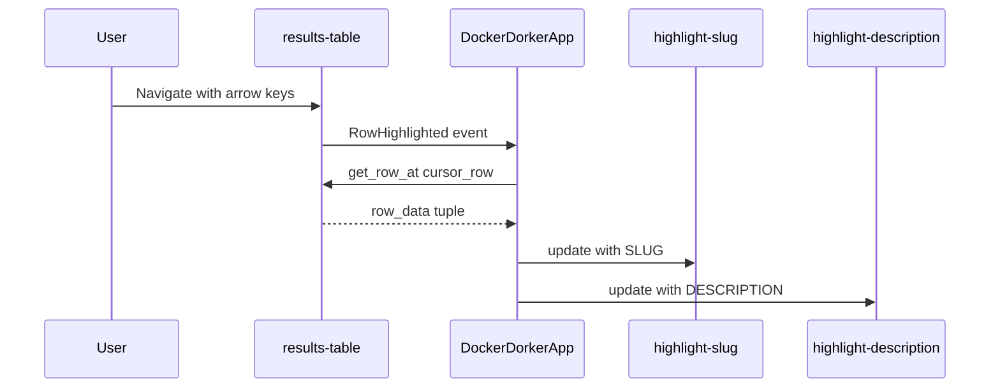

# Feature: Highlighted Row Info Display

## Overview
Add a container widget beneath the results-table in SearchPanel that displays the SLUG and Description of the currently highlighted row. This utilizes unused space above the pagination controls.

## Current Structure

The SearchPanel ([`search_panel.py`](../app/tui/widgets/search_panel/search_panel.py)) currently contains:
1. `#search-label` - Static title "Search Docker Hub"
2. `#search-input` - Input field with placeholder
3. `#search-status` - Empty Static for status messages
4. `#results-table` - DataTable with `height: 1fr` (fills available space)
5. `#pagination-container` - Centered Horizontal bar with buttons and status

The layout is vertical flow. The table uses `1fr` to fill remaining space.

## Proposed Changes

### 1. Modify search_panel.py

Add a new container between `#results-table` and `#pagination-container`:

```python
# After yield DataTable(id="results-table", cursor_type="row")
# Add:
yield Static("", id="highlight-slug")
yield Static("", id="highlight-description")
```

The container will hold two Static widgets:
- `#highlight-slug` - Displays the full SLUG (column 0)
- `#highlight-description` - Displays the full DESCRIPTION (column 4)

### 2. Update styles.tcss

Add styles for the new widgets in [`styles.tcss`](../app/tui/widgets/search_panel/styles.tcss):

```css
/* Highlight info section - displays selected row details */
#highlight-slug {
    height: auto;
    width: 100%;
    padding: 0 1;
    color: $accent;
    text-style: bold;
}

#highlight-description {
    height: auto;
    width: 100%;
    padding: 0 1;
    color: $text-muted;
}
```

Key styling considerations:
- `height: auto` allows text wrapping
- `width: 100%` uses full viewport width
- No truncation - text will wrap naturally
- Positioned between the table (which has a border) and pagination

### 3. Add Event Handler in app.py

Add a handler for `DataTable.RowHighlighted` in [`app.py`](../app/tui/app.py):

```python
def on_data_table_row_highlighted(self, event: DataTable.RowHighlighted) -> None:
    """Handle row highlight changes to update the info display."""
    table = event.data_table
    
    # Only handle results-table
    if table.id != "results-table":
        return
    
    cursor_row = event.cursor_row
    
    # Handle empty or invalid state
    if cursor_row < 0 or cursor_row >= table.row_count:
        return
    
    row_data = table.get_row_at(cursor_row)
    if not row_data:
        return
    
    # Extract SLUG (column 0) and DESCRIPTION (column 4)
    slug = str(row_data[0]) if row_data[0] else ""
    description = str(row_data[4]) if len(row_data) > 4 and row_data[4] else ""
    
    # Update the highlight info widgets
    highlight_slug = self.query_one("#highlight-slug", Static)
    highlight_description = self.query_one("#highlight-description", Static)
    
    highlight_slug.update(f"SLUG: {slug}")
    highlight_description.update(f"DESC: {description}")
```

## Implementation Order

1. **search_panel.py** - Add the two new Static widgets in [`compose()`](../app/tui/widgets/search_panel/search_panel.py:19)
2. **styles.tcss** - Add styles for `#highlight-slug` and `#highlight-description`
3. **app.py** - Add `on_data_table_row_highlighted()` event handler

## Visual Layout (After Implementation)

```
+--------------------------------------------------+
| Search Docker Hub                                |
+--------------------------------------------------+
| [Enter search term...]                           |
+--------------------------------------------------+
| (search status)                                  |
+--------------------------------------------------+
| SLUG | FAV | PULLS | UPDATED | DESCRIPTION      |
|------|-----|-------|---------|------------------|
| ...  | ... | ...   | ...     | ...              |
| ...  | ... | ...   | ...     | ...              |
+--------------------------------------------------+
| SLUG: library/nginx                              |
| DESC: Official build of Nginx, a high...         |
+--------------------------------------------------+
|        << | < | > | >>  Page 1 of 10             |
+--------------------------------------------------+
```

## Event Flow



## Files to Modify

| File | Change |
|------|--------|
| [`app/tui/widgets/search_panel/search_panel.py`](../app/tui/widgets/search_panel/search_panel.py) | Add two Static widgets in compose method |
| [`app/tui/widgets/search_panel/styles.tcss`](../app/tui/widgets/search_panel/styles.tcss) | Add CSS rules for new widgets |
| [`app/tui/app.py`](../app/tui/app.py) | Add on_data_table_row_highlighted handler |

## Considerations

- The highlight info should be empty/blank when no results are loaded
- The text should wrap naturally without horizontal scrolling
- The feature activates on highlight (cursor movement), not just selection (Enter key)
- Both widgets update together when the user navigates through results
