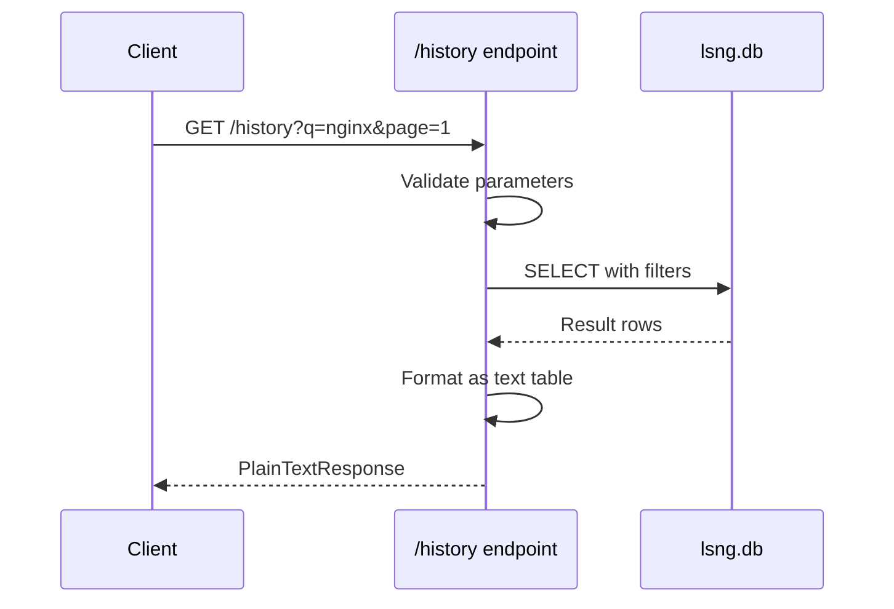

# Build Plan: /history API Endpoint

## Overview

Implement a FastAPI endpoint `/history` that queries the local SQLite database to display previously-peeked Docker image layers in formatted plain text.

**Source Requirements**: [peekHistory.md](peekHistory.md)

---

## Acceptance Criteria

Task is NOT COMPLETED until all criteria are met:

- [ ] 1. **FastAPI route**: `/history?q={query}&page={NaN}&page_size={NaN}&order={asc|desc}&sortby={column}`
- [ ] 2. Prints **FORMATTED TEXT**, NOT JSON
- [ ] 3. Results can be **sorted**
- [ ] 4. Results can be **paginated**
- [ ] 5. Results can be **filtered**

---

## Technical Specification

### Endpoint Definition

```
GET /history
```

### Query Parameters

| Parameter | Type | Default | Description |
|-----------|------|---------|-------------|
| `q` | string | None | Search filter - matches against owner, repo, or tag |
| `page` | int | 1 | Page number (1-indexed) |
| `page_size` | int | 30 | Results per page |
| `sortby` | string | `scraped_at` | Column to sort by |
| `order` | string | `desc` | Sort order: `asc` or `desc` |

### Valid `sortby` Values

- `scraped_at`
- `owner`
- `repo`
- `tag`
- `layer_index`
- `layer_size`

### Output Format

Plain text table with fixed-width columns:

```
| scraped_at   | owner                     | repo                      | tag                  | layer | size       |
|--------------|---------------------------|---------------------------|----------------------|-------|------------|
| 2026-01-14   | alpine                    | git                       | v2.52.0              | 1     | 31.7 MB    |
| 2026-01-14   | alpine                    | git                       | v2.52.0              | 2     | 93 B       |
```

**Column Width Constraints**:
- `scraped_at`: 12 chars (date only: YYYY-MM-DD)
- `owner`: max 25 chars (truncate with `...`)
- `repo`: max 25 chars (truncate with `...`)
- `tag`: max 20 chars (truncate with `...`)
- `layer_index`: 5 chars
- `layer_size`: human-readable format

### Response Headers

- `Content-Type: text/plain`
- Include pagination metadata in header or footer line

---

## Database Query

**Table**: `layer_metadata`

**Schema** (relevant columns):
```sql
layer_digest TEXT PRIMARY KEY,
image_ref TEXT,
owner TEXT,
repo TEXT,
tag TEXT,
layer_index INTEGER,
layer_size INTEGER,
scraped_at DATETIME
```

**Base Query Pattern**:
```sql
SELECT scraped_at, owner, repo, tag, layer_index, layer_size
FROM layer_metadata
WHERE (owner LIKE '%{q}%' OR repo LIKE '%{q}%' OR tag LIKE '%{q}%')  -- if q provided
ORDER BY {sortby} {order}
LIMIT {page_size} OFFSET {(page-1) * page_size}
```

---

## Implementation Tasks

### 1. Add query function to storage.py

**File**: [app/modules/keepers/storage.py](../app/modules/keepers/storage.py)

Add this function after the existing [`get_all_layers()`](../app/modules/keepers/storage.py:461) function:

```python
# Valid columns for sorting history results
HISTORY_SORTABLE_COLUMNS = ['scraped_at', 'owner', 'repo', 'tag', 'layer_index', 'layer_size']


def get_history_paginated(
    conn: sqlite3.Connection,
    q: str = None,
    page: int = 1,
    page_size: int = 30,
    sortby: str = "scraped_at",
    order: str = "desc"
) -> tuple[list[dict], int]:
    """
    Get paginated layer history with optional search filter.
    
    Args:
        conn: SQLite connection
        q: Optional search string to filter owner, repo, or tag
        page: Page number (1-indexed)
        page_size: Results per page
        sortby: Column to sort by (must be in HISTORY_SORTABLE_COLUMNS)
        order: Sort order ('asc' or 'desc')
        
    Returns:
        Tuple of (list of row dicts, total count)
    """
    cursor = conn.cursor()
    base_columns = "scraped_at, owner, repo, tag, layer_index, layer_size"
    
    if q:
        where_clause = "WHERE owner LIKE ? OR repo LIKE ? OR tag LIKE ?"
        search_param = f"%{q}%"
        params = [search_param, search_param, search_param]
        
        # Count total matching results
        count_query = f"SELECT COUNT(*) FROM layer_metadata {where_clause}"
        cursor.execute(count_query, params)
        total_count = cursor.fetchone()[0]
        
        # Fetch paginated results
        data_query = (
            f"SELECT {base_columns} FROM layer_metadata "
            f"{where_clause} "
            f"ORDER BY {sortby} {order.upper()} "
            f"LIMIT ? OFFSET ?"
        )
        params.extend([page_size, (page - 1) * page_size])
        cursor.execute(data_query, params)
    else:
        count_query = "SELECT COUNT(*) FROM layer_metadata"
        cursor.execute(count_query)
        total_count = cursor.fetchone()[0]
        
        data_query = (
            f"SELECT {base_columns} FROM layer_metadata "
            f"ORDER BY {sortby} {order.upper()} "
            f"LIMIT ? OFFSET ?"
        )
        cursor.execute(data_query, [page_size, (page - 1) * page_size])
    
    rows = [dict(row) for row in cursor.fetchall()]
    return rows, total_count
```

---

### 2. Add import and helper functions to api.py

**File**: [app/modules/api/api.py](../app/modules/api/api.py)

Add import at the top with other imports (around line 10):

```python
from app.modules.keepers import storage
```

Add helper functions before the endpoint definitions (around line 28):

```python
# Valid columns for sorting history results (mirrors storage.HISTORY_SORTABLE_COLUMNS)
HISTORY_SORTABLE_COLUMNS = ['scraped_at', 'owner', 'repo', 'tag', 'layer_index', 'layer_size']


def truncate_string(s: str, max_len: int) -> str:
    """Truncate string to max_len, adding '...' if truncated."""
    if s is None:
        return ""
    if len(s) <= max_len:
        return s
    return s[:max_len - 3] + "..."


def format_size(size_bytes: int) -> str:
    """Convert bytes to human-readable format."""
    if size_bytes is None:
        return "0 B"
    for unit in ['B', 'KB', 'MB', 'GB']:
        if abs(size_bytes) < 1024.0:
            return f"{size_bytes:.1f} {unit}"
        size_bytes /= 1024.0
    return f"{size_bytes:.1f} TB"


def format_history_table(rows: list, page: int, page_size: int, total_count: int) -> str:
    """
    Format database rows as a plain text table.
    
    Column widths:
    - scraped_at: 12 (date only)
    - owner: 25
    - repo: 25
    - tag: 20
    - layer_index: 5
    - layer_size: 10
    """
    header = (
        f"| {'scraped_at':<12} | {'owner':<25} | {'repo':<25} | "
        f"{'tag':<20} | {'layer':<5} | {'size':<10} |"
    )
    separator = (
        f"|{'-'*14}|{'-'*27}|{'-'*27}|{'-'*22}|{'-'*7}|{'-'*12}|"
    )
    
    lines = [header, separator]
    
    for row in rows:
        scraped = str(row['scraped_at'])[:10] if row['scraped_at'] else ""
        
        line = (
            f"| {scraped:<12} | "
            f"{truncate_string(row['owner'], 25):<25} | "
            f"{truncate_string(row['repo'], 25):<25} | "
            f"{truncate_string(row['tag'], 20):<20} | "
            f"{row['layer_index']:<5} | "
            f"{format_size(row['layer_size']):<10} |"
        )
        lines.append(line)
    
    total_pages = (total_count + page_size - 1) // page_size if total_count > 0 else 1
    footer = f"\nPage {page} of {total_pages} | {total_count} total results"
    lines.append(footer)
    
    return "\n".join(lines)
```

---

### 3. Add the /history endpoint to api.py

**File**: [app/modules/api/api.py](../app/modules/api/api.py)

Add this endpoint at the end of the file (after line 266):

```python
@app.get("/history", response_class=PlainTextResponse)
def history(
    q: str = Query(default=None, description="Search filter for owner, repo, or tag"),
    page: int = Query(default=1, ge=1, description="Page number"),
    page_size: int = Query(default=30, ge=1, le=100, description="Results per page"),
    sortby: str = Query(default="scraped_at", description="Column to sort by"),
    order: str = Query(default="desc", description="Sort order: asc or desc")
):
    """
    View history of previously-peeked Docker image layers.
    
    Returns formatted plain text table showing cached layer metadata
    from the local SQLite database.
    
    Example: /history?q=nginx&page=1&sortby=layer_size&order=desc
    """
    # Validate sortby column
    if sortby not in HISTORY_SORTABLE_COLUMNS:
        raise HTTPException(
            status_code=400,
            detail=f"sortby must be one of: {', '.join(HISTORY_SORTABLE_COLUMNS)}"
        )
    
    # Validate order
    if order not in ['asc', 'desc']:
        raise HTTPException(
            status_code=400,
            detail="order must be 'asc' or 'desc'"
        )
    
    try:
        conn = storage.init_database()
        rows, total_count = storage.get_history_paginated(
            conn=conn,
            q=q,
            page=page,
            page_size=page_size,
            sortby=sortby,
            order=order
        )
        conn.close()
        
        if not rows:
            if q:
                return f"No results found matching '{q}'\n"
            return "No cached layers found. Run a peek operation first.\n"
        
        return format_history_table(rows, page, page_size, total_count)
        
    except Exception as e:
        raise HTTPException(
            status_code=500,
            detail=f"Database error: {str(e)}"
        )
```

---

### 4. Summary of Changes

| File | Changes |
|------|---------|
| [app/modules/keepers/storage.py](../app/modules/keepers/storage.py) | Add `HISTORY_SORTABLE_COLUMNS` constant and `get_history_paginated()` function |
| [app/modules/api/api.py](../app/modules/api/api.py) | Add import, helper functions, and `/history` endpoint |

---

## Architecture Diagram



---

## Example Requests and Expected Output

### Default request (last 30 results):
```bash
curl "http://127.0.0.1:8000/history"
```

### Search for alpine images:
```bash
curl "http://127.0.0.1:8000/history?q=alpine"
```

### Page 2, sorted by size descending:
```bash
curl "http://127.0.0.1:8000/history?page=2&sortby=layer_size&order=desc"
```

### Expected Output Format:
```
| scraped_at   | owner                     | repo                      | tag                  | layer | size       |
|--------------|---------------------------|---------------------------|----------------------|-------|------------|
| 2026-01-14   | alpine                    | git                       | v2.52.0              | 1     | 31.7 MB    |
| 2026-01-14   | alpine                    | git                       | v2.52.0              | 2     | 93.0 B     |
| 2026-01-14   | alpine                    | git                       | v2.52.0              | 0     | 3.1 MB     |

Page 1 of 1 | 3 total results
```

---

## Files to Modify

| File | Location | Changes |
|------|----------|---------|
| [app/modules/keepers/storage.py](../app/modules/keepers/storage.py) | After line 470 | Add `HISTORY_SORTABLE_COLUMNS` and `get_history_paginated()` |
| [app/modules/api/api.py](../app/modules/api/api.py) | ~10 | Add `from app.modules.keepers import storage` |
| [app/modules/api/api.py](../app/modules/api/api.py) | ~28 | Add `HISTORY_SORTABLE_COLUMNS`, helper functions |
| [app/modules/api/api.py](../app/modules/api/api.py) | EOF | Add `/history` endpoint |

---

## Testing Checklist

### Manual Testing via curl

```bash
# Test 1: Default request - should return last 30 results
curl "http://127.0.0.1:8000/history"

# Test 2: Pagination - page 2
curl "http://127.0.0.1:8000/history?page=2"

# Test 3: Search filter - should only show matching results
curl "http://127.0.0.1:8000/history?q=alpine"

# Test 4: Sort by layer_size descending
curl "http://127.0.0.1:8000/history?sortby=layer_size&order=desc"

# Test 5: Invalid sortby - should return 400
curl "http://127.0.0.1:8000/history?sortby=invalid_column"

# Test 6: Invalid order - should return 400
curl "http://127.0.0.1:8000/history?order=invalid"

# Test 7: Combined parameters
curl "http://127.0.0.1:8000/history?q=git&page=1&page_size=10&sortby=scraped_at&order=asc"
```

### Validation Criteria

- [ ] Response has `Content-Type: text/plain`
- [ ] Table header row displays correctly
- [ ] Column alignment is consistent
- [ ] Long owner/repo/tag values are truncated with `...`
- [ ] Layer size shows human-readable format (KB, MB, GB)
- [ ] Pagination footer shows correct page/total info
- [ ] Empty results show helpful message
- [ ] Invalid parameters return HTTP 400 with clear error message
