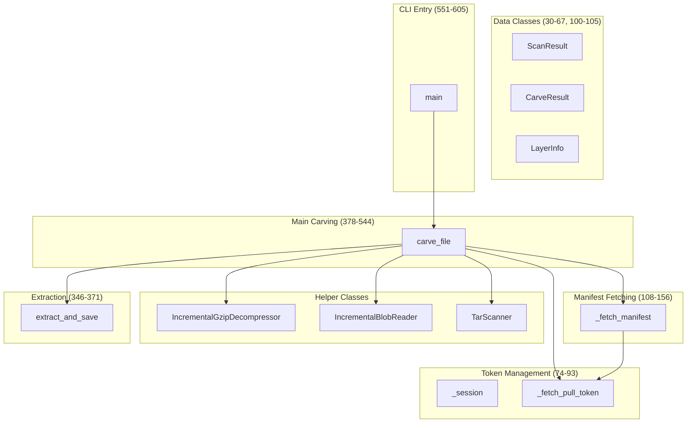
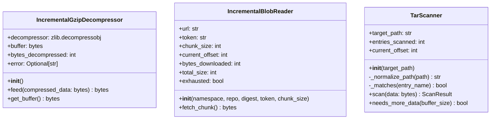
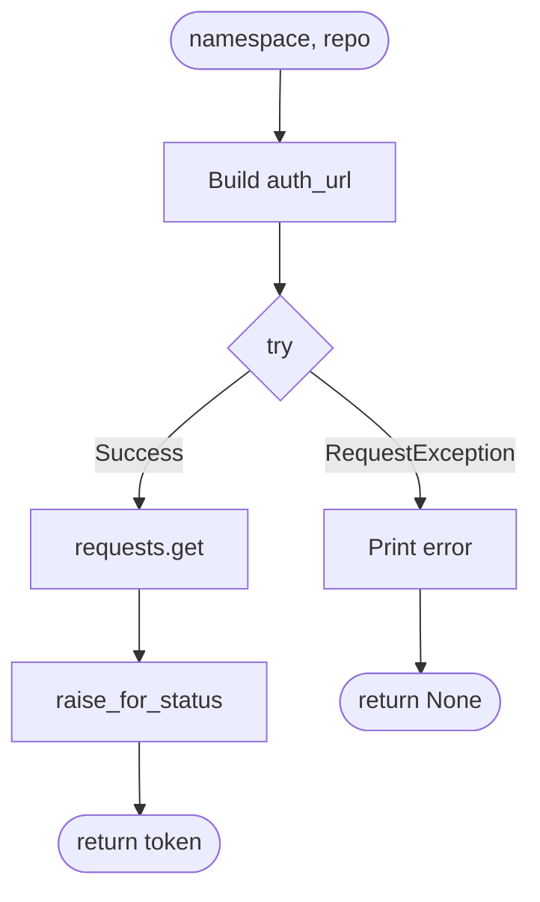
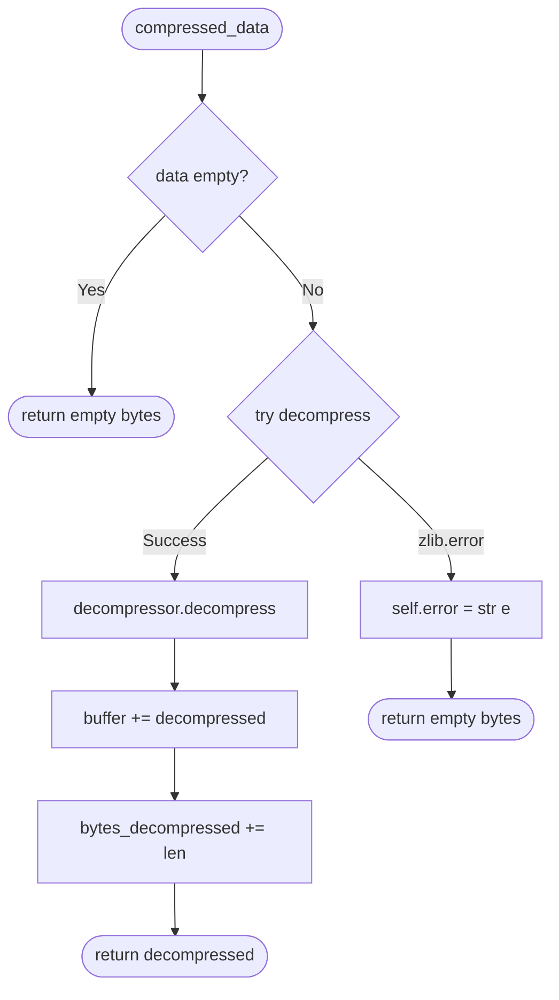
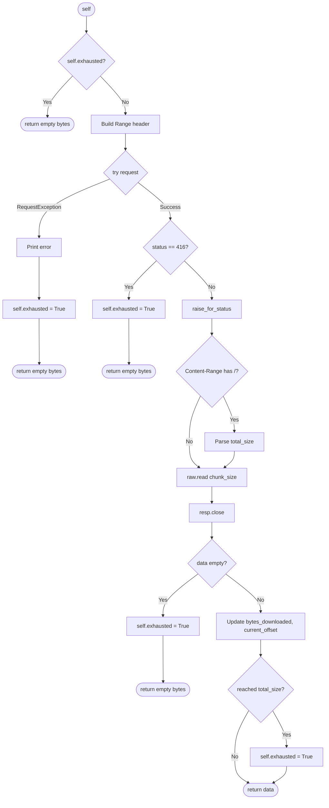
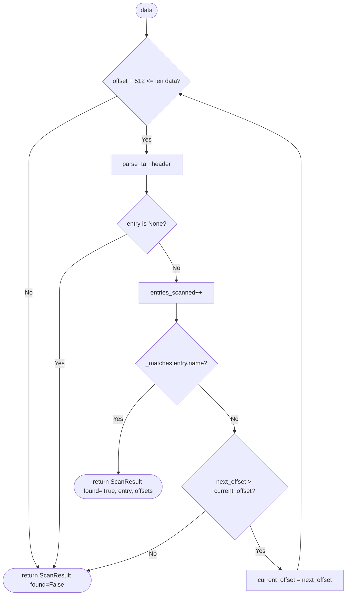
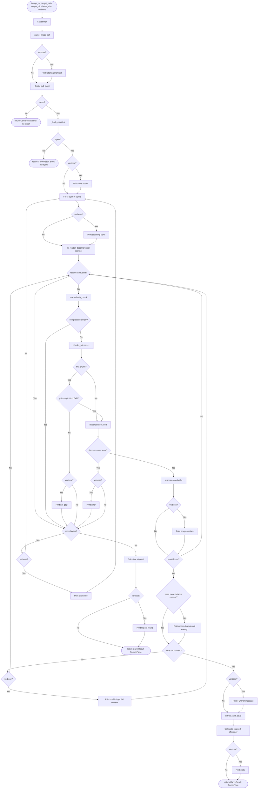
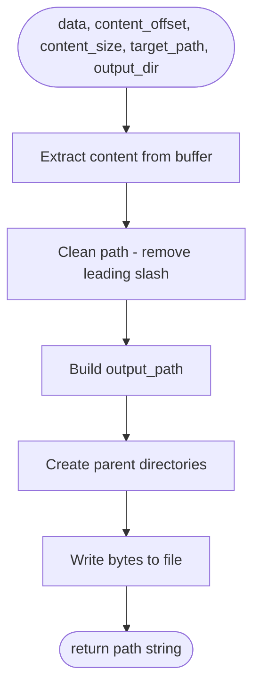
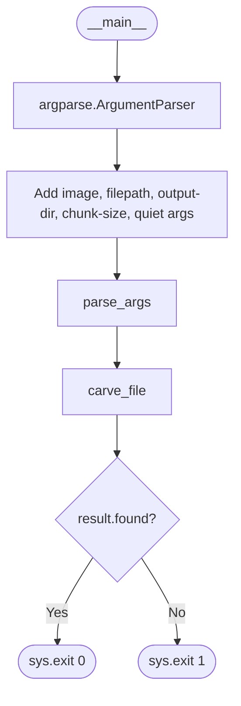
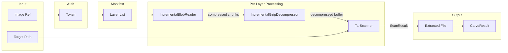

## Code Structure Overview for `carver.py`

The file contains:
- 2 constants ([`DEFAULT_CHUNK_SIZE`](carver.py:22), [`DEFAULT_OUTPUT_DIR`](carver.py:23))
- 4 dataclasses ([`ScanResult`](carver.py:30), [`CarveResult`](carver.py:40), [`LayerInfo`](carver.py:100))
- 3 classes ([`IncrementalGzipDecompressor`](carver.py:163), [`IncrementalBlobReader`](carver.py:201), [`TarScanner`](carver.py:276))
- 1 module-level session ([`_session`](carver.py:74))
- 5 functions ([`_fetch_pull_token()`](carver.py:81), [`_fetch_manifest()`](carver.py:108), [`extract_and_save()`](carver.py:346), [`carve_file()`](carver.py:378), [`main()`](carver.py:551))

## Module Organization

## Class Diagrams

## Main Function Control Flows

### _fetch_pull_token (81-93)

### _fetch_manifest (108-156)

flowchart TD
    START([namespace, repo, tag, token]) --> BUILD[Build URL and headers]
    BUILD --> TRY_REQ{try request}
    TRY_REQ -->|RequestException| ERR[Print error]
    ERR --> RET_EMPTY([return empty list])
    TRY_REQ -->|Success| GET_JSON[resp.json to manifest]
    
    GET_JSON --> CHECK_MEDIA{mediaType is multi-arch?}
    
    CHECK_MEDIA -->|No| EXTRACT_LAYERS
    CHECK_MEDIA -->|Yes| GET_LIST[Get manifests array]
    
    GET_LIST --> FIND_AMD64[Search for amd64/linux platform]
    FIND_AMD64 --> FOUND_AMD64{Found amd64/linux?}
    
    FOUND_AMD64 -->|Yes| SET_TARGET[target = matching manifest]
    FOUND_AMD64 -->|No| HAS_ANY{manifests array not empty?}
    
    HAS_ANY -->|Yes| USE_FIRST[target = first manifest]
    HAS_ANY -->|No| TARGET_CHECK
    
    SET_TARGET --> TARGET_CHECK
    USE_FIRST --> TARGET_CHECK
    
    TARGET_CHECK{target exists?}
    TARGET_CHECK -->|No| EXTRACT_LAYERS
    TARGET_CHECK -->|Yes| FETCH_DIGEST[Fetch manifest by target digest]
    FETCH_DIGEST --> UPDATE_MANIFEST[manifest = new response]
    UPDATE_MANIFEST --> EXTRACT_LAYERS
    
    EXTRACT_LAYERS[Extract layers from manifest]
    EXTRACT_LAYERS --> LOOP[For each layer in manifest.layers]
    LOOP --> CREATE[Create LayerInfo with digest, size, mediaType]
    CREATE --> APPEND[Append to layers list]
    APPEND --> MORE{more layers?}
    MORE -->|Yes| LOOP
    MORE -->|No| RETURN([return layers list])

### IncrementalGzipDecompressor.feed (175-190)

### IncrementalBlobReader.fetch_chunk (222-269)

### TarScanner.scan (300-335)

### carve_file (378-544) - Main Carving Logic

### extract_and_save (346-371)

### main (551-605) - CLI Entry

## Summary of Branch Points

| Location | Condition | Branches |
|----------|-----------|----------|
| Line 87-93 | `requests.get` exception | Return None or return token |
| Line 121-123 | `requests.get` exception in manifest | Return empty list |
| Line 127 | `mediaType` contains manifest.list/image.index | Multi-arch handling or direct extraction |
| Line 133-134 | Platform is amd64/linux | Set target or continue loop |
| Line 136-137 | No target found, manifests exist | Use first manifest as fallback |
| Line 139 | Target exists | Fetch by digest or skip |
| Line 180-190 | `zlib.error` in decompress | Set error and return empty |
| Line 226-227 | `self.exhausted` | Return empty or continue |
| Line 239-241 | HTTP 416 status | Mark exhausted |
| Line 247-248 | Content-Range has `/` | Parse total size |
| Line 253-255 | Data empty | Mark exhausted |
| Line 261-262 | Reached total_size | Mark exhausted |
| Line 266-269 | `RequestException` | Print error, mark exhausted |
| Line 310-312 | `entry is None` | Break scan loop |
| Line 317-325 | `_matches(entry.name)` | Return found result |
| Line 328-329 | `next_offset <= current_offset` | Break scan loop |
| Line 408/428/433... | `verbose` flag | Print progress or skip |
| Line 412-417 | Token fetch failed | Return error result |
| Line 421-426 | No layers found | Return error result |
| Line 447-448 | Compressed chunk empty | Break chunk loop |
| Line 453-457 | First chunk, not gzip | Skip layer |
| Line 462-465 | Decompression error | Break chunk loop |
| Line 475 | `result.found` | Extract file or continue scanning |
| Line 481-489 | Need more data for content | Fetch additional chunks |
| Line 492-526 | Have full content | Extract and return success |
| Line 527-530 | Incomplete content | Print warning, continue |

## Data Flow Through Components

The carving process uses an incremental streaming approach: it fetches compressed data in chunks via HTTP Range requests, decompresses on-the-fly, scans tar headers looking for the target file, and stops as soon as the target is fully extracted - avoiding downloading entire layers unnecessarily.