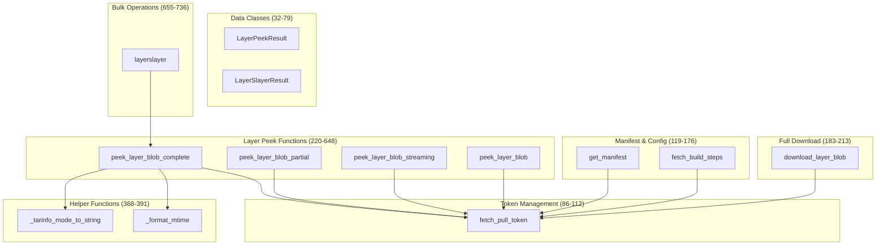
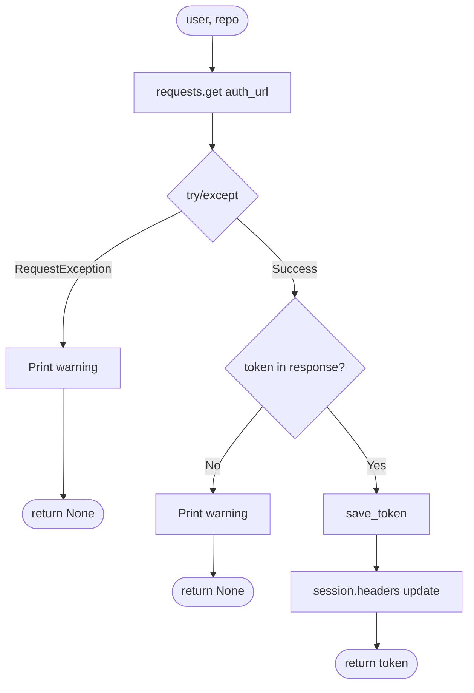
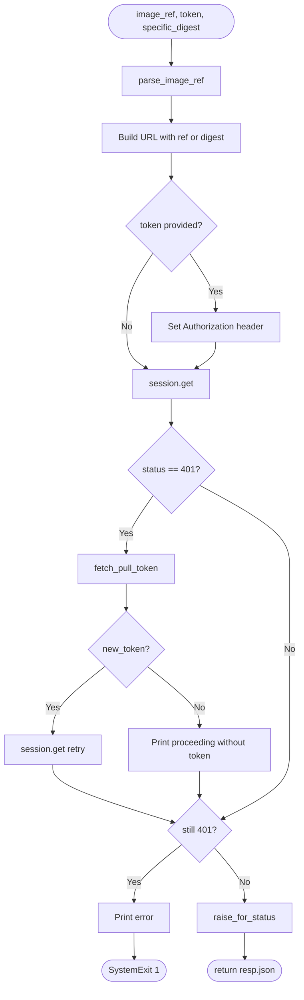
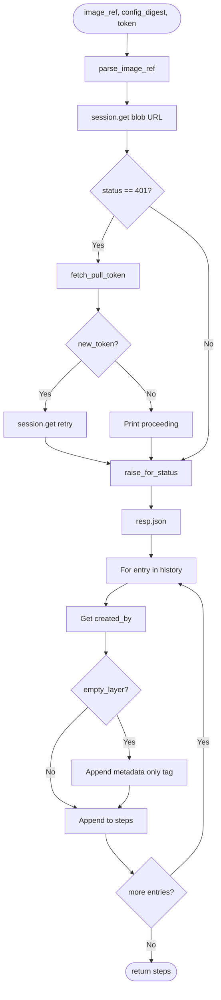
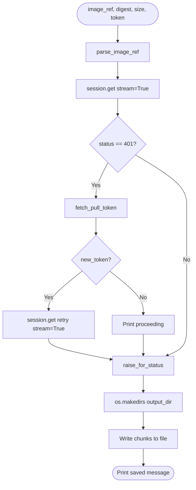
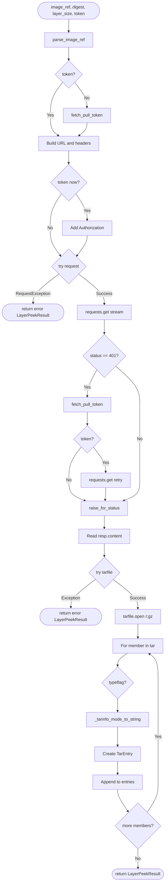
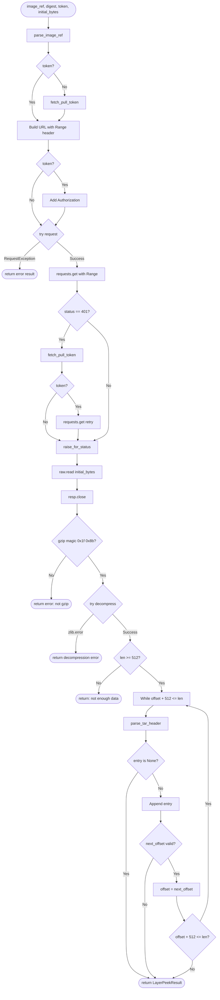
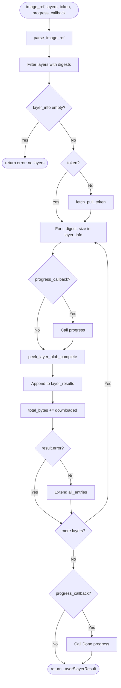
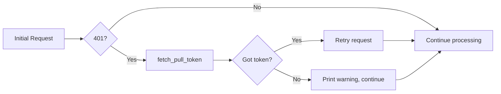

## Code Structure Overview for `fetcher.py`

The file contains:
- 2 dataclasses ([`LayerPeekResult`](fetcher.py:32), [`LayerSlayerResult`](fetcher.py:56))
- 1 module-level session ([`session`](fetcher.py:22))
- 9 functions organized into 5 logical sections

## Module Organization

## Main Function Control Flows

### fetch_pull_token (86-112)

### get_manifest (119-148)

### fetch_build_steps (151-176)

### download_layer_blob (183-213)

### peek_layer_blob_complete (260-365)

### peek_layer_blob_partial (394-519)

### layerslayer (655-736)

### Helper Functions

```mermaid
flowchart TD
    subgraph TarinfoMode["_tarinfo_mode_to_string (368-379)"]
        TM_START([mode, typeflag]) --> TYPE_CHAR[Map typeflag to d/l/-]
        TYPE_CHAR --> LOOP[For shift in 6,3,0]
        LOOP --> BITS[Extract 3 bits]
        BITS --> R{bit 4?}
        R -->|Yes| ADD_R[+= r]
        R -->|No| ADD_RD[+= -]
        ADD_R --> W{bit 2?}
        ADD_RD --> W
        W -->|Yes| ADD_W[+= w]
        W -->|No| ADD_WD[+= -]
        ADD_W --> X{bit 1?}
        ADD_WD --> X
        X -->|Yes| ADD_X[+= x]
        X -->|No| ADD_XD[+= -]
        ADD_X --> MORE{more shifts?}
        ADD_XD --> MORE
        MORE -->|Yes| LOOP
        MORE -->|No| TM_RET([return type_char + perms])
    end
    
    subgraph FormatMtime["_format_mtime (382-391)"]
        FM_START([unix_timestamp]) --> TRY{try}
        TRY --> NEG{timestamp <= 0?}
        NEG -->|Yes| DASH([return dashes])
        NEG -->|No| CONVERT[datetime.fromtimestamp]
        CONVERT --> FORMAT([return strftime])
        TRY -->|OSError/ValueError/Overflow| DASH
    end
```

## Summary of Branch Points

| Location | Condition | Branches |
|----------|-----------|----------|
| Line 97-101 | `requests.get` exception | Return None or continue |
| Line 104-106 | `token` in response | Return None or save and return |
| Line 129-130 | `token` provided | Set auth header or skip |
| Line 133-139 | `status_code == 401` | Refresh token or continue |
| Line 141-145 | Still 401 after retry | SystemExit(1) or continue |
| Line 159-165 | `status_code == 401` | Refresh token or continue |
| Line 173-174 | `empty_layer` flag | Add metadata tag or not |
| Line 191-197 | `status_code == 401` | Refresh token or continue |
| Line 230-236 | `token` provided/fetched | Set auth header or not |
| Line 239-244 | `status_code == 401` | Refresh and retry or continue |
| Line 253-257 | `member.isdir()` | Print [DIR] or [FILE] |
| Line 284-285 | `token` provided | Fetch new token or use existing |
| Line 291-292 | `token` available | Set auth header or skip |
| Line 298-302 | `status_code == 401` | Refresh and retry or continue |
| Line 306-315 | `RequestException` | Return error result |
| Line 329 | `typeflag` | Map to d/l/- character |
| Line 356-365 | Tar extraction exception | Return error result |
| Line 386-387 | `timestamp <= 0` | Return dashes |
| Line 390 | `OSError/ValueError/Overflow` | Return dashes |
| Line 419-420 | `token` provided | Fetch new or use existing |
| Line 429-430 | `token` available | Set auth header or skip |
| Line 436-440 | `status_code == 401` | Refresh and retry |
| Line 448-457 | `RequestException` | Return error result |
| Line 460-469 | Gzip magic check | Return error if not gzip |
| Line 475-484 | `zlib.error` | Return decompression error |
| Line 486-495 | Decompressed size < 512 | Return insufficient data error |
| Line 503-510 | `entry is None` or offset invalid | Break parse loop |
| Line 684-693 | Empty `layer_info` | Return error result |
| Line 696-697 | `token` provided | Fetch new or use existing |
| Line 705-706 | `progress_callback` | Call callback or skip |
| Line 719-720 | `result.error` | Skip extending entries |
| Line 722-723 | `progress_callback` | Call done callback or skip |

## Authentication Retry Pattern

All network functions follow the same authentication retry pattern:

