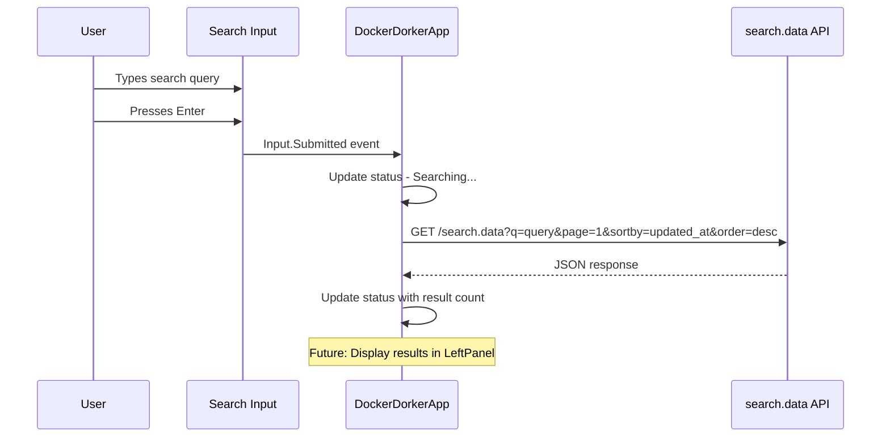

# Plan: Add Search Input Widget to TUI

## Overview

Add a textual Input widget to the Top Panel in [`app/tui/app.py`](app/tui/app.py) that submits search queries to the `search.data` API endpoint.

**API Endpoint:** `http://127.0.0.1:8000/search.data?q={q}&page=1&sortby=updated_at&order=desc`

---

## Implementation Steps

### Step 1: Add Required Imports

Add the `Input` widget, `work` decorator for async workers, and `httpx` for HTTP requests to [`app/tui/app.py`](app/tui/app.py:11-13):

```python
from textual.app import App, ComposeResult
from textual.containers import Horizontal
from textual.widgets import Header, Footer, Static, Input
from textual.worker import work
import httpx
```

### Step 2: Modify TopPanel Widget

Update the [`TopPanel`](app/tui/app.py:16-18) class to compose the Input widget inside it:

```python
class TopPanel(Static):
    """Top panel widget with search input."""
    
    def compose(self) -> ComposeResult:
        yield Input(
            placeholder="Search Docker Hub...",
            id="search-input",
            type="text"
        )
        yield Static("", id="search-status")
```

### Step 3: Update compose Method

Modify the [`compose`](app/tui/app.py:38-45) method in `DockerDorkerApp` to yield the TopPanel without initial text:

```python
def compose(self) -> ComposeResult:
    """Compose the UI layout."""
    yield Header(show_clock=True)
    yield TopPanel(id="top-panel")
    with Horizontal(id="main-content"):
        yield LeftPanel("Search Results go Here", id="left-panel")
        yield RightPanel("Right Panel", id="right-panel")
    yield Footer()
```

### Step 4: Add Input.Submitted Event Handler with Worker

Add event handler using Textual's Worker API (via `@work` decorator) for proper async HTTP handling. This follows Textual best practices for network requests:

```python
def on_input_submitted(self, event: Input.Submitted) -> None:
    """Handle search input submission."""
    query = event.value.strip()
    if not query:
        return
    
    # Update status and trigger the worker
    status = self.query_one("#search-status", Static)
    status.update(f"Searching for: {query}...")
    self.search_docker_hub(query)

@work(exclusive=True)
async def search_docker_hub(self, query: str) -> None:
    """Worker to perform the search API call."""
    status = self.query_one("#search-status", Static)
    
    try:
        async with httpx.AsyncClient() as client:
            response = await client.get(
                "http://127.0.0.1:8000/search.data",
                params={
                    "q": query,
                    "page": 1,
                    "sortby": "updated_at",
                    "order": "desc"
                }
            )
            response.raise_for_status()
            data = response.json()
            
            # Update UI from worker (call_from_thread not needed for async workers)
            status.update(f"Found {len(data.get('results', []))} results")
            # TODO: Display results in left panel (Task 1 continued)
            
    except httpx.RequestError as e:
        status.update(f"Request error: {e}")
    except httpx.HTTPStatusError as e:
        status.update(f"HTTP error: {e.response.status_code}")
```

**Note:** The `@work(exclusive=True)` decorator ensures that:
- Only one search runs at a time (cancels previous searches)
- The async operation doesn't block the UI
- Proper cleanup on app shutdown

### Step 5: Update Styles

Add Input widget styling to [`app/tui/styles.tcss`](app/tui/styles.tcss:10-16):

```css
/* Top panel - flows below header in vertical layout */
#top-panel {
    height: auto;
    min-height: 5;
    padding: 1 2;
    background: $surface;
    border: solid $primary;
    layout: vertical;
}

/* Search input styling */
#search-input {
    width: 100%;
    margin-bottom: 1;
}

#search-status {
    height: auto;
    color: $text-muted;
}
```

### Step 6: Add httpx Dependency

Add `httpx` to [`requirements.txt`](requirements.txt):

```
httpx
```

---

## Complete Modified app.py

```python
"""
dockerDorkerUI

A basic UI structure with:
- Header (docked top)
- Top Panel (1/3) with search input
- Left/Right Panels (50/50 split, 2/3 height)
- Footer (docked bottom)
"""

from textual.app import App, ComposeResult
from textual.containers import Horizontal
from textual.widgets import Header, Footer, Static, Input
from textual import work
import httpx


class TopPanel(Static):
    """Top panel widget with search input."""
    
    def compose(self) -> ComposeResult:
        yield Input(
            placeholder="Search Docker Hub...",
            id="search-input",
            type="text"
        )
        yield Static("", id="search-status")


class LeftPanel(Static):
    """Left panel widget (50% width)."""
    pass


class RightPanel(Static):
    """Right panel widget (50% width)."""
    pass


class DockerDorkerApp(App):
    """dockerDorker - A Textual app with a basic UI layout."""

    CSS_PATH = "styles.tcss"
    TITLE = "dockerDorker"
    SUB_TITLE = "by @thesavant42"

    def compose(self) -> ComposeResult:
        """Compose the UI layout."""
        yield Header(show_clock=True)
        yield TopPanel(id="top-panel")
        with Horizontal(id="main-content"):
            yield LeftPanel("Search Results go Here", id="left-panel")
            yield RightPanel("Right Panel", id="right-panel")
        yield Footer()

    def on_mount(self) -> None:
        """Set the Dracula theme when the app mounts."""
        self.theme = "dracula"

    def on_input_submitted(self, event: Input.Submitted) -> None:
        """Handle search input submission."""
        query = event.value.strip()
        if not query:
            return
        
        # Update status and trigger the worker
        status = self.query_one("#search-status", Static)
        status.update(f"Searching for: {query}...")
        self.search_docker_hub(query)

    @work(exclusive=True)
    async def search_docker_hub(self, query: str) -> None:
        """Worker to perform the search API call."""
        status = self.query_one("#search-status", Static)
        
        try:
            async with httpx.AsyncClient() as client:
                response = await client.get(
                    "http://127.0.0.1:8000/search.data",
                    params={
                        "q": query,
                        "page": 1,
                        "sortby": "updated_at",
                        "order": "desc"
                    }
                )
                response.raise_for_status()
                data = response.json()
                
                status.update(f"Found {len(data.get('results', []))} results")
                # TODO: Display results in left panel (Task 1 continued)
                
        except httpx.RequestError as e:
            status.update(f"Request error: {e}")
        except httpx.HTTPStatusError as e:
            status.update(f"HTTP error: {e.response.status_code}")


if __name__ == "__main__":
    app = DockerDorkerApp()
    app.run()
```

---

## Architecture Flow



---

## Checklist

- [ ] Add `Input` import to app.py
- [ ] Add `httpx` import to app.py
- [ ] Modify `TopPanel` to compose Input widget
- [ ] Update `compose` method to yield TopPanel without text
- [ ] Add `on_input_submitted` async event handler
- [ ] Update styles.tcss for Input and TopPanel layout
- [ ] Add `httpx` to requirements.txt
- [ ] Test search submission works correctly
