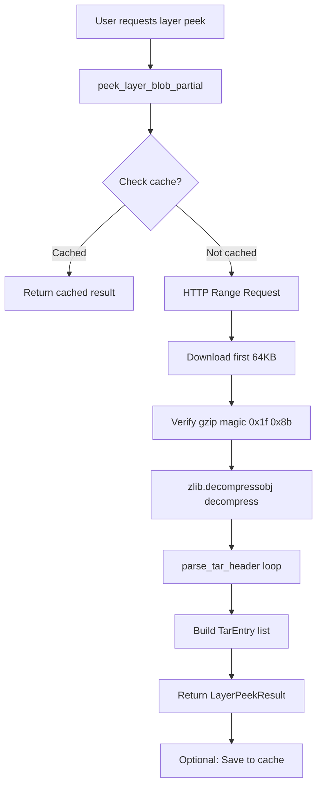

# Streaming Layer Peek Implementation Plan

## Problem Statement

The current lsng implementation downloads **entire layer blobs** (potentially 30MB+) just to list file contents. The dockerdorker implementation uses **HTTP Range requests** to fetch only the first 8-64KB, achieving the same file listing with 0.027% of the data.

## Current vs Target Implementation

### Current lsng (`fetcher.py` lines 139-165)
```python
def peek_layer_blob(image_ref, digest, token=None):
    # Downloads ENTIRE blob into memory
    resp = session.get(url, stream=True)
    tar_bytes = io.BytesIO(resp.content)  # Full download!
    with tarfile.open(fileobj=tar_bytes, mode="r:gz") as tar:
        for member in tar.getmembers():
            # List files...
```

### Target: dockerdorker approach
```python
def peek_layer_blob_partial(namespace, repo, digest, token=None, initial_bytes=65536):
    # HTTP Range request - only fetch first 64KB
    headers = {"Range": f"bytes=0-{initial_bytes - 1}"}
    resp = session.get(url, headers=headers, stream=True)
    compressed_data = resp.raw.read(initial_bytes)
    
    # Manual gzip decompression (handles partial streams)
    decompressor = zlib.decompressobj(16 + zlib.MAX_WBITS)
    decompressed = decompressor.decompress(compressed_data)
    
    # Manual tar header parsing
    while offset + 512 <= len(decompressed):
        entry, next_offset = parse_tar_header(decompressed, offset)
        # ...
```

## Key Technical Differences

| Aspect | Current lsng | dockerdorker |
|--------|--------------|--------------|
| Data fetched | Full blob (MB) | First 64KB |
| Decompression | `tarfile` module | `zlib.decompressobj` |
| Tar parsing | `tarfile.open()` | Manual 512-byte header parsing |
| File metadata | Basic (name, size, is_dir) | Rich (mode, uid, gid, mtime, symlinks) |
| Caching | None | Database-backed layer cache |
| Architecture | Single function | Modular (fetcher + parser + dataclasses) |

## Implementation Plan

### Phase 1: Add Tar Header Parser Module

Create a new `tar_parser.py` with:

1. **`TarEntry` dataclass** - File entry with rich metadata
   - `name: str` - Full path
   - `size: int` - File size in bytes
   - `typeflag: str` - Tar type flag
   - `is_dir: bool` - Directory flag
   - `mode: str` - Unix permissions string (e.g., "drwxr-xr-x")
   - `uid: int` - User ID
   - `gid: int` - Group ID
   - `mtime: str` - Formatted modification time
   - `linkname: str` - Symlink target
   - `is_symlink: bool` - Symlink flag
   - `to_dict()` method for JSON serialization

2. **`parse_tar_header(data, offset)`** function
   - Parse 512-byte POSIX ustar tar header
   - Return `(TarEntry, next_offset)` or `(None, -1)` on invalid
   - Handle both GNU and POSIX tar formats

3. **Helper functions**
   - `_mode_to_string(mode_int, typeflag)` - Convert octal to "drwxr-xr-x"
   - `_parse_octal(data, default)` - Safe octal parsing
   - `_format_mtime(unix_timestamp)` - Format timestamps

### Phase 2: Add Streaming Peek Functions to Fetcher

Update `fetcher.py` with:

1. **`LayerPeekResult` dataclass**
   - `digest: str`
   - `partial: bool`
   - `bytes_downloaded: int`
   - `bytes_decompressed: int`
   - `entries_found: int`
   - `entries: list[TarEntry]`
   - `error: Optional[str]`
   - `to_dict()` method

2. **`peek_layer_blob_partial()`** function
   - Use HTTP Range header: `Range: bytes=0-65535`
   - Verify gzip magic bytes (0x1f 0x8b)
   - Decompress with `zlib.decompressobj(16 + zlib.MAX_WBITS)`
   - Parse tar headers iteratively
   - Return `LayerPeekResult`

3. **`peek_layer_blob_streaming()`** generator (optional)
   - Same as partial but yields entries as discovered
   - Useful for progressive UI updates

### Phase 3: Add Bulk Layer Slayer Function

Add to `fetcher.py`:

1. **`LayerSlayerResult` dataclass**
   - `image_digest: str`
   - `layers_peeked: int`
   - `layers_from_cache: int`
   - `total_bytes_downloaded: int`
   - `total_entries: int`
   - `all_entries: list[TarEntry]` - Merged from all layers
   - `layer_results: list[LayerPeekResult]`
   - `error: Optional[str]`

2. **`layerslayer()`** function
   - Accept list of layer dicts
   - Optionally check cache first (if db provided)
   - Peek each layer via `peek_layer_blob_partial()`
   - Optionally cache results
   - Return combined `LayerSlayerResult`

### Phase 4: Update CLI Integration

Update `layerslayer.py`:

1. Replace calls to `peek_layer_blob()` with `peek_layer_blob_partial()`
2. Update output formatting to use `TarEntry` rich metadata
3. Add `--fast-peek` flag (or make it default)
4. Show download stats (bytes downloaded vs layer size)

### Phase 5: Optional Database Caching

Create `database.py` (optional enhancement):

1. SQLite-based cache for layer peek results
2. Methods:
   - `layer_peek_cached(digest) -> bool`
   - `get_cached_layer_peek(digest) -> dict`
   - `save_layer_peek(digest, namespace, repo, result)`

## File Changes Summary

| File | Action | Description |
|------|--------|-------------|
| `tar_parser.py` | CREATE | New module for TarEntry and parse_tar_header |
| `fetcher.py` | MODIFY | Add peek_layer_blob_partial, LayerPeekResult, LayerSlayerResult, layerslayer |
| `layerslayer.py` | MODIFY | Update to use new streaming functions |
| `parser.py` | KEEP | Existing manifest parsing (unrelated to tar parsing) |
| `utils.py` | KEEP | No changes needed |
| `database.py` | CREATE (optional) | Caching support |

## Data Flow Diagram



## Expected Benefits

1. **Bandwidth reduction**: ~99.97% less data downloaded per layer
2. **Speed improvement**: Seconds instead of minutes for large layers
3. **Rich metadata**: Unix permissions, timestamps, symlinks
4. **Caching support**: Avoid re-fetching known layers
5. **Streaming option**: Progressive UI updates

## Risks and Mitigations

| Risk | Mitigation |
|------|------------|
| Range requests not supported | Fall back to full download |
| Partial gzip decompression fails | Increase initial_bytes or fall back |
| Truncated file listing | Document as "preview" - not complete |
| Non-gzip layers (rare) | Detect and handle gracefully |

## Testing Strategy

1. Test with various image types (alpine, ubuntu, node, python)
2. Compare file listings with full download method
3. Verify permissions/metadata accuracy
4. Test with very small layers (< 64KB)
5. Test with layers that have many small files at start
6. Test auth token handling
