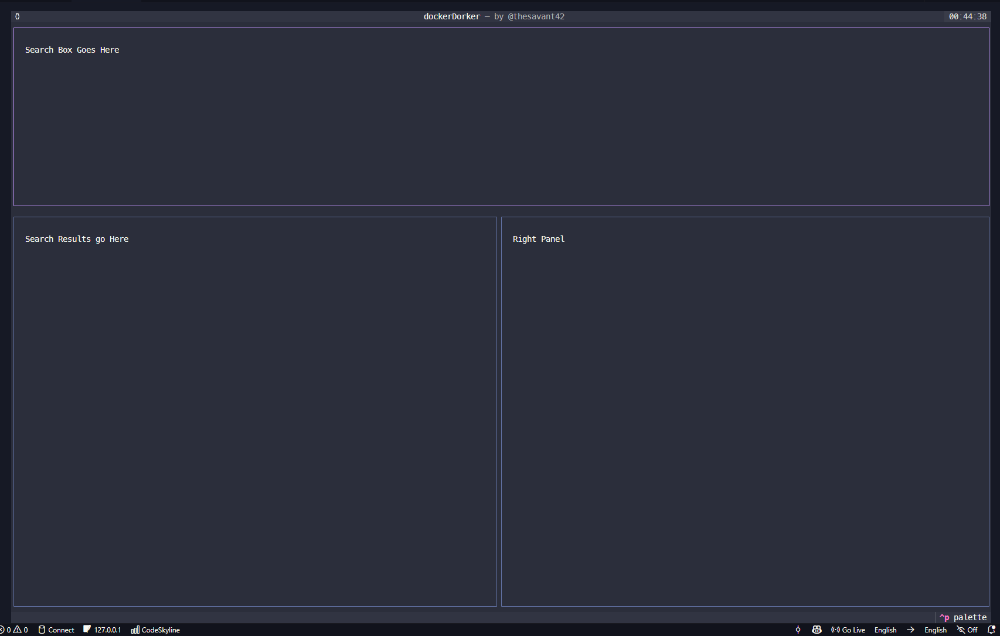

## USER STORY

I want to find containers related to a topic, "disney" in this example.

### Start
- I open the app and see:
	1. Info Panel, right side: A Text Input widget: Description: "search Docker Hub"
		- Routes to the `/search.data` [Docker Hub passthrough route](http://localhost:8000/search.data?q=disney)
    2. [A table of recently assesed containers](http://localhost:8000/history) in the LEFT PANEL
	http://127.0.0.1:8000/history?page=1&page_size=30&sortby=scraped_at&order=desc

### search.data
- I search the recents, and, finding 0 matches, opt for #3, `/search.data` [here](http://localhost:8000/search.data?q=disney)
	- Each result is for 1 respository in includes the namespace/owner of the repository.
	- If the namespace, repository name, or description seem worth investigating I will want to dig in on a repository.
	- To view files or folders we need to get the [TAGs](###Tags) available in a repository via the `/repositories/{namespace}/{repo}/tags` API.

---

## Task 1: Add Search box

- This is the base of the TUI. The Textual `header` widget is present on the same row as the title text "dockerDocker by @thesavant42"
- Beneath the Header is the `Top-Panel`
- Beneath the `Top-Panel` are the `Left Panel` and `Right Panel`.




Task 1. Need to include a textual "text" type Input Widget in the `TOP PANEL`, that submits to `/search.data`
    - `http://127.0.0.1:8000/search.data?q=disney&page=1&sortby=updated_at&order=desc`


- Results Should Display in the `LEFT PANEL`:
    - `dataTable` with "row" cursor
    - Text labels must NOT wrap or break tables
    - **Un-truncated versions of each field to be displayed in `TOP PANEL`**
```bash

Total: 204 results (page 1)

SLUG                                     FAV  PULLS  CREATED      UPDATED      DESCRIPTION
----------------------------------------------------------------------------------------------------
ebusinessdocker/disney                   0    285    04-25-2017   11-02-2017   
nlds90/disney                            0    162    05-20-2015   10-16-2015   
thangadurai90/disney                     0    49     03-18-2019   03-20-2019   Sample test for docker compose
tanaebousfiha/disney                     0    45     10-14-2025   10-14-2025   
msmengr/disney                           0    42     03-24-2025   04-21-2025   
dematrix/disney                          0    42     03-24-2025   03-24-2025   Deo test
springheroku/disney                      0    32     10-03-2022   10-12-2022   
markcataluna/disney                      0    32     04-21-2025   04-21-2025   test lab
kodujmy/disney                           0    31     10-12-2022   10-01-2023   
surajpjoshi/disney                       0    24     11-09-2023   11-09-2023   
v3yy/disney                              0    21     09-16-2024   09-16-2024   
sundar21/disney                          0    18     12-07-2021   12-07-2021   
chaitanyagutti16/disney                  0    18     01-27-2024   01-27-2024   
wonjongg/disney                          0    12     05-20-2022   05-20-2022   
hexletsource/disney-userbase             0    254    08-11-2015   08-24-2015   Disney Userbase 
bennycooly/disney-scraper                0    100K+  10-24-2020   07-22-2022   
ofcommunity/rorpage-openfaas-disney-display-disney-display 0    10K+   06-15-2018   08-01-2018   
disneystreaming/pg2k4j                   0    100K+  10-27-2018   06-03-2019   A tool for publishing changes made on a Postgresql database to an Amazon Kinesis Stream
aciliadevops/disney-local-php            0    5.1K   06-26-2023   01-19-2026   
aciliadevops/disney-local-php-fpm        0    6.1K   06-26-2023   01-19-2026   
aciliadevops/disney-local-web            0    4.1K   06-26-2023   01-19-2026   
gberg927/disney-height-requirements      0    10K+   11-23-2019   03-04-2020   
dpreardon/disneyreservation              1    223    11-09-2018   02-27-2019   Check the availability of certain restaurants at Walt Disney World.
dayaron/disneyworld-metrics-datadog      0    255    03-28-2024   05-23-2024   Docker Image that sends Disney World Wait Times to Datadog as custom metrics.
aciliadevops/disney-local-node           0    1.2K   11-28-2024   01-19-2026   
mahkumazahn/disney-reservation-checker   0    60     04-25-2021   04-25-2021   Scrapes for Disney Restaurant Reservations 
aciliadevops/disney-local-php-fpm-8.3    0    993    11-19-2025   01-19-2026   
pessoalize/pessoalize-disney-admin-v3    0    3.9K   01-16-2022   09-13-2023   
aciliadevops/disney-local-php-8.3        0    525    11-19-2025   01-19-2026   
disneyresolve/vuln-container             0    1.6K   04-25-2023   04-25-2023   Vulnerable Container for demo purpose
```


[Continued in next task](/plans/userstory.MD)   

---
