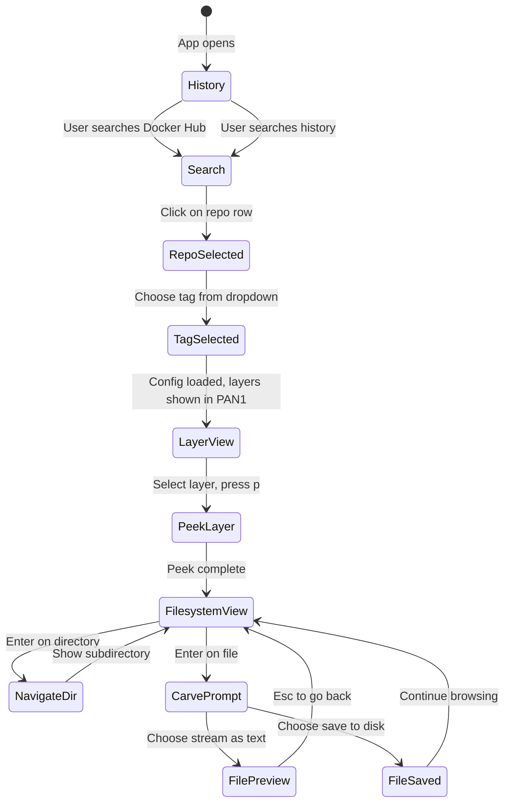

# Textual TUI Architecture Plan

## Visual Layout - Matching Your ASCII Sketch

```
+-----------------------------------------------------------------------+
|  HEADER                                                               |
+-----------------------------------------------------------------------+
|  Namespace / REPO Description,              [SEARCH]  [DROPDOWN TAGS] |
|                                                                       |
|  Row 2: Additional metadata or empty space                            |
|  Row 3: Approximately 3-5 rows tall panel                             |
+-----------------------------------+-----------------------------------+
|  PAN 1: LAYERS LIST (35% Width)   |  PAN 2: COMMAND DETAIL (65% W)    |
|                                   |                                   |
|  [Selected] 1. ADD alpine...      |  +-----------------------------+  |
|  [ ]        2. CMD ["/bin/sh"]    |  | FILE SYSTEM                 |  |
|  [ ]        3. RUN ...            |  |                             |  |
|  [ ]        4. ...                |  | drwxr-xr-x 0/0  boot/       |  |
|                                   |  | drwxr-xr-x 0/0  dev/        |  |
|                                   |  | drwxr-xr-x 0/0  etc/        |  |
|                                   |  | drwxr-xr-x 0/0  home/       |  |
|                                   |  | -rw-r--r-- 0/0  Gemfile     |  |
|                                   |  |                             |  |
|                                   |  +-----------------------------+  |
|                                   |                                   |
+-----------------------------------+-----------------------------------+
|  FOOTER: Hotkeys Debug                                                |
+-----------------------------------------------------------------------+
```

## Component Breakdown

### 1. Header
- Standard Textual Header widget
- Application title
- Optional dark mode toggle or status indicators

### 2. Info Panel - 5 rows
- **Row 1-2**: Repository metadata when a repo is selected
  - Namespace, repo name, description, stats
- **Row 3-4**: Search inputs
  - Text input for Docker Hub search
  - Text input for local history search  
- **Row 5**: Tag dropdown selector
  - Populated after selecting a repository
  - Triggers image config fetch when changed

### 3. PAN 1: Layers Panel - 35% width
- Vertical scrolling list of layers from image config
- Each layer shows:
  - Checkbox state: peeked or not
  - Index number
  - Build command preview - truncated
  - Layer size
- Selecting a layer triggers fslog view in PAN 2
- Empty layers still shown - have metadata but no files

### 4. PAN 2: Content Viewer - 65% width
- ContentSwitcher widget with multiple views:

| State | Content | Triggered By |
|-------|---------|--------------|
| SEARCH_RESULTS | DataTable of search results | Submitting search |
| REPO_TAGS | Tag list for selected repo | Clicking search result |
| LAYER_CONFIG | Raw config JSON | Selecting tag before peek |
| FILESYSTEM | fslog output as navigable tree | Selecting peeked layer |
| FILE_PREVIEW | Carved file contents | Carving with as_text |

### 5. Footer
- Standard Textual Footer with hotkey bindings
- Context-sensitive: shows relevant keys for current state

## User Flow Diagram



## API Endpoints Used

| UI Action | API Endpoint |
|-----------|--------------|
| Search Docker Hub | `/search.data?q=...` |
| Search history | `/history?q=...` |
| Get repo tags | `/repositories/{ns}/{repo}/tags` |
| Get image config | `/repositories/{ns}/{repo}/tags/{tag}/config` |
| Check peek status | `/peek/status?image=...` |
| Peek layer | `/peek?image=...&layer=...` |
| Browse filesystem | `/fslog?image=...&path=...&layer=...` |
| Carve file | `/carve?image=...&path=...&layer=...` |

## Textual Components to Use

- `Header` - built-in
- `Footer` - built-in  
- `Container` - for info panel
- `Input` - search boxes
- `Select` - tag dropdown
- `DataTable` - search results, filesystem view
- `ListView` or `OptionList` - layer list in PAN 1
- `ContentSwitcher` - swap PAN 2 content based on state
- `Static` or `RichLog` - file preview
- Modal dialogs for carve confirmation

## External Libraries

- `textual-web` - for browser-based access
- `textual-fspicker` - for save file dialogs
- `textual-plotext` - optional: visualize layer sizes

## Questions for Clarification

1. Should history table be visible on app startup, or should user explicitly request it?
2. When navigating filesystem, should parent directory - .. - always be shown for going back?
3. Should there be a breadcrumb trail showing current path in filesystem navigation?
