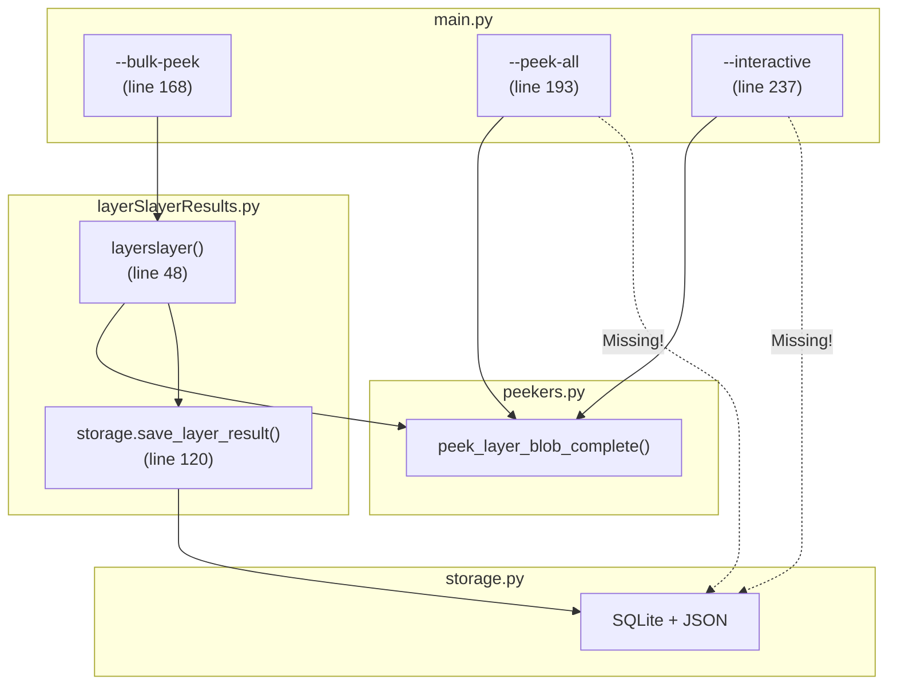

The storage logging to SQLite and JSON **only happens in `--bulk-peek` mode**, not in `--peek-all` or interactive modes. Here's why:

## Code Path Analysis

| Mode | Function Called | Storage Logic |
|------|----------------|---------------|
| `--bulk-peek` | [`layerslayer()`](app/modules/keepers/layerSlayerResults.py:48) | **YES** - calls [`storage.save_layer_result()`](app/modules/keepers/layerSlayerResults.py:120) |
| `--peek-all` | [`peek_layer_blob_complete()`](main.py:203) directly | **NO** - bypasses storage entirely |
| `--interactive` | [`peek_layer_blob_complete()`](main.py:244) directly | **NO** - bypasses storage entirely |

## The Problem

[`main.py:203`](main.py:203) and [`main.py:244`](main.py:244) call `peek_layer_blob_complete()` **directly**, completely bypassing the [`layerslayer()`](app/modules/keepers/layerSlayerResults.py:48) function which contains the storage integration at [line 120](app/modules/keepers/layerSlayerResults.py:120).

## To Fix

The `--peek-all` and interactive modes need to either:
1. Call `layerslayer()` instead of `peek_layer_blob_complete()` directly, OR
2. Add explicit calls to `storage.init_database()` and `storage.save_layer_result()` after each `peek_layer_blob_complete()` call